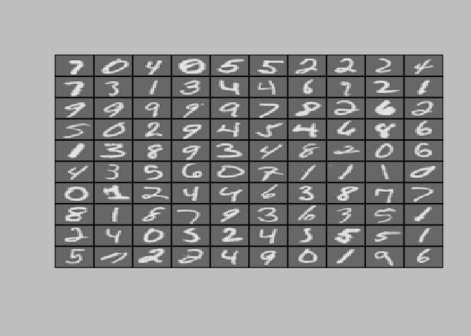
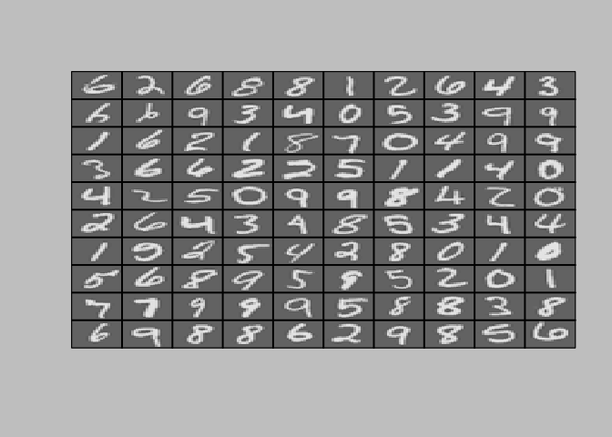

Multi-class Classification and Neural Networks
================

Multi-class Classification
==========================

``` r
## Setup the parameters you will use for this part of the exercise
input_layer_size  <- 400  # 20x20 Input Images of Digits
num_labels <- 10          # 10 labels, from 1 to 10   
                          # (note that we have mapped "0" to label 10)
```

Part 1: Loading and Visualizing Data
------------------------------------

``` r
# Load Training Data
cat(sprintf('Loading and Visualizing Data ...\n'))
```

    ## Loading and Visualizing Data ...

``` r
load('ex3data1.Rda') #data
list2env(data,.GlobalEnv)
```

    ## <environment: R_GlobalEnv>

``` r
rm(data)

m <- dim(X)[1]
```

``` r
displayData  <- function(X, example_width = round(sqrt(dim(X)[2])))  {
  #DISPLAYDATA Display 2D data in a nice grid
  #   [h, display_array] <- DISPLAYDATA(X, example_width) displays 2D data
  #   stored in X in a nice grid. It returns the figure handle h and the
  #   displayed array if requested.
  
  if (is.vector(X))
    X <- t(X)
  
  # Compute rows, cols
  m <- dim(X)[1]
  n <- dim(X)[2]
  
  example_height <- (n / example_width) #20
  
  # Compute number of items to display
  display_rows <- floor(sqrt(m)) #10
  display_cols <- ceiling(m / display_rows) #10
  
  # Between images padding
  pad <- 1
  
  # Setup blank display
  display_array <-
    -matrix(0,pad + display_rows * (example_height + pad),
            pad + display_cols * (example_width + pad))
  
  # Copy each example into a patch on the display array
  curr_ex <- 1
  for (j in 1:display_rows) {
    for (i in 1:display_cols) {
      if (curr_ex > m)
        break
      # Copy the patch
      
      # Get the max value of the patch
      max_val <- max(abs(X[curr_ex,]))
      display_array[pad + (j - 1) * (example_height + pad) + (1:example_height),
                    pad + (i - 1) * (example_width + pad) + (1:example_width)] <-
        matrix(X[curr_ex,], example_height, example_width) / max_val
      curr_ex <- curr_ex + 1
    }
    if (curr_ex > m)
      break
  }
  
  # Display Image
  op <- par(bg = "gray")
  
  #image draws by row from bottom up, but R indexes matrices by column, top down
  dispArr <- t(apply(display_array,2,rev))
  
  image(
    z = dispArr,col = gray.colors(100), xaxt = 'n',yaxt = 'n'
  )
  
  grid(
    nx = display_cols,display_rows,col = 'black',lwd = 2,lty = 1
  )
  box()
  par(op)
  
  
}
```

``` r
# Randomly select 100 data points to display
rand_indices <- sample(m)
sel <- X[rand_indices[1:100], ]

displayData(sel)
```



　Part 2: Vectorize Logistic Regression
---------------------------------------

``` r
oneVsAll <- function(X, y, num_labels, lambda) {
  #ONEVSALL trains multiple logistic regression classifiers and returns all
  #the classifiers in a matrix all_theta, where the i-th row of all_theta
  #corresponds to the classifier for label i
  #   all_theta <- ONEVSALL(X, y, num_labels, lambda) trains num_labels
  #   logisitc regression classifiers and returns each of these classifiers
  #   in a matrix all_theta, where the i-th row of all_theta corresponds
  #   to the classifier for label i
  
  # Some useful variables
  m <- dim(X)[1]
  n <- dim(X)[2]
  
  all_theta <- matrix(0,num_labels,n + 1)
  
  # Add ones to the X data matrix
  X <- cbind(rep(1,m),X)
  
　sigmoid <- function(z) {
  #SIGMOID Compute sigmoid functoon
  #   J <- SIGMOID(z) computes the sigmoid of z.
    g <- matrix(0,dim(as.matrix(z)))
  g <- 1 / (1 + exp(-1 * z))
  g
　}


　lrCostFunction <- function(X, y, lambda) {
  #lrCostFunction Compute cost for logistic regression with
  #regularization
  #   J <- lrCostFunction(X, y, lambda)(theta) computes the cost of using
  #   theta as the parameter for regularized logistic regression.
  
  function(theta) {
    # Initialize some useful values
    m <- length(y) # number of training examples
    J <- 0
    
    # calculate cost function
    h <- sigmoid(X %*% theta)
    # calculate penalty
    # excluded the first theta value
    theta1 <- c(0,c(theta[-1]))
    
    p <- lambda * (t(theta1) %*% theta1) / (2 * m)
    J <- -(t(y) %*% log(h) + t(1 - y) %*% log(1 - h)) / m + p
    J
  　}
　}

　lrGradFunction <- function(X, y, lambda) {
  #lrGradFunction Compute  gradient for logistic regression with
  #regularization
  #   J <- lrGradFunction( X, y, lambda)(theta) computes the
  #   gradient of the cost w.r.t. to the parameters.
  function(theta) {
    # Initialize some useful values
    m <- length(y) # number of training examples
    
    grad <- matrix(0,length(theta))
    
    # calculate cost function
    h <- sigmoid(X %*% theta)
    # calculate penalty
    # excluded the first theta value
    theta1 <- c(0,c(theta[-1]))
    
    # calculate grads
    grad <- (t(X) %*% (h - y) + lambda * theta1) / m
    
    grad
　  }
　}

  
  for (i in 1:num_labels)
  {
    initial_theta <- rep(0,n + 1)
    opt <- optim(
      initial_theta,lrCostFunction(X,y == i,lambda),
      gr = lrGradFunction(X,y == i,lambda),method = "BFGS"
      ,control = list(maxit = 50)
    )
    theta <- opt$par
    cat(sprintf("Iteration %d | Min Cost: %f\n",i,opt$value))
    
    all_theta[i,] <- t(theta)
  }
  all_theta

}
```

``` r
cat(sprintf('\nTraining One-vs-All Logistic Regression...\n'))
```

    ## 
    ## Training One-vs-All Logistic Regression...

``` r
lambda <- 0.1
all_theta <- oneVsAll(X, y, num_labels, lambda)
```

    ## Iteration 1 | Min Cost: 0.022615
    ## Iteration 2 | Min Cost: 0.068263
    ## Iteration 3 | Min Cost: 0.071419
    ## Iteration 4 | Min Cost: 0.049558
    ## Iteration 5 | Min Cost: 0.075337
    ## Iteration 6 | Min Cost: 0.032426
    ## Iteration 7 | Min Cost: 0.044076
    ## Iteration 8 | Min Cost: 0.093442
    ## Iteration 9 | Min Cost: 0.087671
    ## Iteration 10 | Min Cost: 0.016490

Part 3: Predict for One-Vs-All
------------------------------

``` r
predictOneVsAll  <- function(all_theta, X) {
  #PREDICT Predict whether the label is 0 or 1 using learned logistic
  #regression parameters all_theta
  #   p <- PREDICT(all_theta, X) computes the predictions for X using a
  #   threshold at 0.5 (i.e., if sigmoid(t(all_theta) %*% x) >= 0.5, predict 1)
  m <- dim(X)[1]
  num_labels <- dim(all_theta)[1]
  p <- rep(0,dim(X)[1])
  # Add ones to the X data matrix
  X <- cbind(rep(1,m), X)
  
  sigmoid <- function(z) {
  #SIGMOID Compute sigmoid functoon
  #   J <- SIGMOID(z) computes the sigmoid of z.
    g <- matrix(0,dim(as.matrix(z)))
  g <- 1 / (1 + exp(-1 * z))
  g
　}

  ps <- sigmoid(X %*% t(all_theta))
  i_max <- apply(ps,1, which.max)
  p <- i_max
  p  
  # --------------------------------------------------------------------------
}

pred <- predictOneVsAll(all_theta, X)
cat(sprintf('\nTraining Set Accuracy: %f\n', mean(pred == y) * 100))
```

    ## 
    ## Training Set Accuracy: 93.180000

Neural Networks
===============

``` r
## Setup the parameters you will use for this exercise
input_layer_size  <- 400;  # 20x20 Input Images of Digits
hidden_layer_size <- 25;   # 25 hidden units
num_labels <- 10;          # 10 labels, from 1 to 10   
                          # (note that we have mapped "0" to label 10)
```

Part 1: Loading and Visualizing Data
------------------------------------

``` r
# Load Training Data
cat(sprintf('Loading and Visualizing Data ...\n'))
```

    ## Loading and Visualizing Data ...

``` r
load('ex3data1.Rda')
list2env(data,.GlobalEnv)
```

    ## <environment: R_GlobalEnv>

``` r
rm(data)

m <- dim(X)[1]

# Randomly select 100 data points to display
sel <- sample(m)
sel <- sel[1:100]

displayData(X[sel,])
```



Part 2: Loading Pameters
------------------------

``` r
cat(sprintf('\nLoading Saved Neural Network Parameters ...\n'))
```

    ## 
    ## Loading Saved Neural Network Parameters ...

``` r
# Load the weights into variables Theta1 and Theta2
load('ex3weights.Rda')
list2env(data,.GlobalEnv)
```

    ## <environment: R_GlobalEnv>

``` r
rm(data)
```

Part 3: Implement Predict
-------------------------

``` r
predict <- function(Theta1, Theta2, X) {
  #PREDICT Predict the label of an input given a trained neural network
  #   p <- PREDICT(Theta1, Theta2, X) outputs the predicted label of X given the
  #   trained weights of a neural network (Theta1, Theta2)
  
  # Useful values
  if (is.vector(X))
    X <- t(X)
  
  sigmoid <- function(z) {
  #SIGMOID Compute sigmoid functoon
  #   J <- SIGMOID(z) computes the sigmoid of z.
    g <- matrix(0,dim(as.matrix(z)))
  g <- 1 / (1 + exp(-1 * z))
  g
　}

  m <- dim(X)[1]
  num_labels <- dim(Theta2)[1]
  p <- rep(0,m)
  a1 <- cbind(rep(1,m), X)
  z2 <- a1 %*% t(Theta1)
  a2 <- cbind(rep(1,dim(z2)[1]) ,sigmoid(z2))
  z3 <- a2 %*% t(Theta2)
  a3 <- sigmoid(z3)
  p <- apply(a3,1,which.max)
  p
  # --------------------------------------------------------------------------
}
```

``` r
pred <- predict(Theta1, Theta2, X)
cat(sprintf('\nTraining Set Accuracy: %f\n', mean(pred==y) * 100))
```

    ## 
    ## Training Set Accuracy: 97.520000

``` r
#  Randomly permute examples

# rp <- sample(m)
# 
# for (i in 1:m){
#     # Display 
#     cat(sprintf('\nDisplaying Example Image. Press Esc to End\n'))
#     displayData(X[rp[i], ])
# 
#     pred <- predict(Theta1, Theta2, X[rp[i],])
#     cat(sprintf('\nNeural Network Prediction: %d (y %d) (digit %d)\n', pred ,y[rp[i]],pred%%10))
#     
#     Sys.sleep(2)
    #press esc to quit the loop in Rstudio
# }
```
