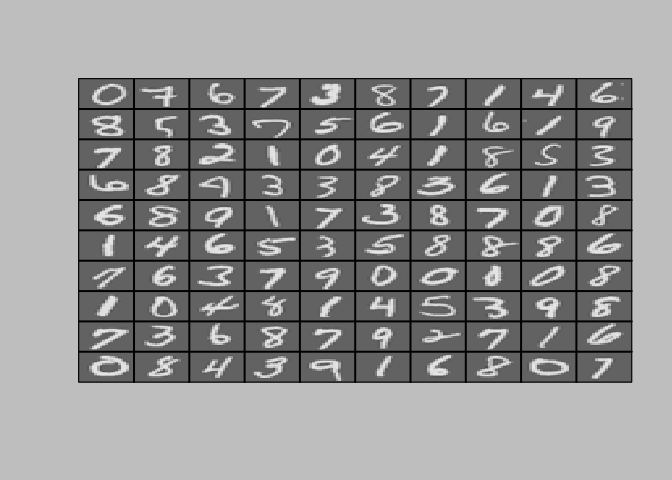

Neural Networks Learning
================

``` r
input_layer_size  <- 400  # 20x20 Input Images of Digits
hidden_layer_size <- 25   # 25 hidden units
num_labels <- 10          # 10 labels, from 1 to 10
                          # (note that we have mapped "0" to label 10)
```

Part 1: Loading and Visualizing Data
------------------------------------

### Loading Data

``` r
# Load Training Data
cat(sprintf('Loading and Visualizing Data ...\n'))
```

    ## Loading and Visualizing Data ...

``` r
load('ex4data1.Rda')
list2env(data,.GlobalEnv)
```

    ## <environment: R_GlobalEnv>

``` r
rm(data)

m <- dim(X)[1]

# Randomly select 100 data points to display
sel <- sample(m)
sel <- sel[1:100]
```

### Visualizing Data

``` r
displayData  <- function(X, example_width = round(sqrt(dim(X)[2])))  {
  #DISPLAYDATA Display 2D data in a nice grid
  #   [h, display_array] <- DISPLAYDATA(X, example_width) displays 2D data
  #   stored in X in a nice grid. It returns the figure handle h and the
  #   displayed array if requested.
  
  # Set example_width automatically if not passed in
  #example_width = round(sqrt(dim(X)[2])) #20
  
  if (is.vector(X))
    X <- t(X)
  
  # Compute rows, cols
  m <- dim(X)[1]
  n <- dim(X)[2]
  
  example_height <- (n / example_width) #20
  
  # Compute number of items to display
  display_rows <- floor(sqrt(m)) #10
  display_cols <- ceiling(m / display_rows) #10
  
  # Between images padding
  pad <- 1
  
  # Setup blank display
  display_array <-
    -matrix(0,pad + display_rows * (example_height + pad),
            pad + display_cols * (example_width + pad))
  
  # Copy each example into a patch on the display array
  curr_ex <- 1
  for (j in 1:display_rows) {
    for (i in 1:display_cols) {
      if (curr_ex > m)
        break
      # Copy the patch
      
      # Get the max value of the patch
      max_val <- max(abs(X[curr_ex,]))
      display_array[pad + (j - 1) * (example_height + pad) + (1:example_height),
                    pad + (i - 1) * (example_width + pad) + (1:example_width)] <-
        matrix(X[curr_ex,], example_height, example_width) / max_val
      curr_ex <- curr_ex + 1
    }
    if (curr_ex > m)
      break
  }
  
  # Display Image
  #par("bg")
  op <- par(bg = "gray")
  #It's confusing because it draws by row from bottom up, but R indexes matrices by column, top down
  display_array <- t(apply(display_array,2,rev))
  
  image(
    z = display_array,col = gray.colors(100), xaxt = 'n',yaxt = 'n'
  )
  grid(
    nx = display_cols,display_rows,col = 'black',lwd = 2,lty = 1
  )
  box()
  par(op)
  
}

displayData(X[sel,])
```



Part 2: Loading Pameters
------------------------

``` r
cat(sprintf('\nLoading Saved Neural Network Parameters ...\n'))
```

    ## 
    ## Loading Saved Neural Network Parameters ...

``` r
# Load the weights into variables Theta1 and Theta2
load('ex4weights.Rda')
list2env(data,.GlobalEnv)
```

    ## <environment: R_GlobalEnv>

``` r
rm(data)

# Unroll parameters
nn_params <-c(c(Theta1),c(Theta2))
```

Part 3: Compute Cost (Feedforward)
----------------------------------

``` r
sigmoid <- function(z) {
  #SIGMOID Compute sigmoid functoon
  #   J <- SIGMOID(z) computes the sigmoid of z.
  g <- matrix(0,dim(as.matrix(z)))
  g <- 1 / (1 + exp(-1 * z))
  g
}
```

``` r
nnCostFunction  <-
  function(input_layer_size, hidden_layer_size, num_labels,X, y, lambda) {
    #NNCOSTFUNCTION Implements the neural network cost function for a two layer
    #neural network which performs classification
    #   J <- NNCOSTFUNCTON(hidden_layer_size, num_labels, ...
    #   X, y, lambda)(nn_params) computes the cost of the neural network. The
    #   parameters for the neural network are "unrolled" into the vector
    #   nn_params and need to be converted back into the weight matrices.
    #
    
    function(nn_params) {
      # Reshape nn_params back into the parameters Theta1 and Theta2, the weight matrices
      # for our 2 layer neural network
      Theta1 <-
        matrix(nn_params[1:(hidden_layer_size * (input_layer_size + 1))],
               hidden_layer_size, (input_layer_size + 1))
      
      Theta2 <-
        matrix(nn_params[(1 + (hidden_layer_size * (input_layer_size + 1))):length(nn_params)],
               num_labels, (hidden_layer_size + 1))
      
      # Setup some useful variables
      m <- dim(X)[1]
      
      J <- 0
      
      # recode y to Y
      I <- diag(num_labels)
      Y <- matrix(0, m, num_labels)
      for (i in 1:m)
        Y[i,] <- I[y[i],]

      # feedforward
      a1 <- cbind(rep(1,m),X)
      z2 <- a1 %*% t(Theta1)
      a2 <- cbind(rep(1,dim(z2)[1]), sigmoid(z2))
      z3 <- a2 %*% t(Theta2)
      a3 <- sigmoid(z3)
      h <- a3
      
      # calculte penalty
      p <- sum(Theta1[,-1] ^ 2) + sum(Theta2[,-1] ^ 2)
      
      # calculate Cost
      J <-
        sum((-Y) * log(h) - (1 - Y) * log(1 - h)) / m + lambda * p / (2 * m)
      
      J
    }
  }

nnGradFunction  <-
  function(input_layer_size, hidden_layer_size, num_labels,
           X, y, lambda) {
    #nnGradFunction Implements the neural network gradient function for a two layer
    #neural network which performs classification
    #   grad <- nnGradFunction(hidden_layer_size, num_labels, ...
    #   X, y, lambda)(nn_params) computes the gradient of the neural network. The
    #   parameters for the neural network are "unrolled" into the vector
    #   nn_params and need to be converted back into the weight matrices.
    #
    #   The returned parameter grad should be a "unrolled" vector of the
    #   partial derivatives of the neural network.
    #
    function(nn_params) {
      # Reshape nn_params back into the parameters Theta1 and Theta2, the weight matrices
      # for our 2 layer neural network
      Theta1 <-
        matrix(nn_params[1:(hidden_layer_size * (input_layer_size + 1))],
               hidden_layer_size, (input_layer_size + 1))
      
      Theta2 <-
        matrix(nn_params[(1 + (hidden_layer_size * (input_layer_size + 1))):length(nn_params)],
               num_labels, (hidden_layer_size + 1))
      
      # Setup some useful variables
      m <- dim(X)[1]
      
      # You need to return the following variables correctly
      Theta1_grad <- matrix(0,dim(Theta1)[1],dim(Theta1)[2])
      Theta2_grad <- matrix(0,dim(Theta2)[1],dim(Theta2)[2])
      
      # recode y to Y
      I <- diag(num_labels)
      Y <- matrix(0, m, num_labels)
      for (i in 1:m)
        Y[i,] <- I[y[i],]
      
      # feedforward
      a1 <- cbind(rep(1,m),X)
      z2 <- a1 %*% t(Theta1)
      a2 <- cbind(rep(1,dim(z2)[1]), sigmoid(z2))
      z3 <- a2 %*% t(Theta2)
      a3 <- sigmoid(z3)
      h <- a3
      
      # calculate sigmas
      sigma3 <- h - Y
      sigma2 <-
        (sigma3 %*% Theta2) * sigmoidGradient(cbind(rep(1,dim(z2)[1]),z2))
      sigma2 <- sigma2[,-1]
      
      # accumulate gradients
      delta_1 <- (t(sigma2) %*% a1)
      delta_2 <- (t(sigma3) %*% a2)
      
      # calculate regularized gradient
      p1 <- (lambda / m) * cbind(rep(0,dim(Theta1)[1]), Theta1[,-1])
      p2 <- (lambda / m) * cbind(rep(0,dim(Theta2)[1]), Theta2[,-1])
      Theta1_grad <- delta_1 / m + p1
      Theta2_grad <- delta_2 / m + p2
      
      # Unroll gradients
      grad <-  c(c(Theta1_grad), c(Theta2_grad))
      grad
    }
  }
```

``` r
cat(sprintf('\nFeedforward Using Neural Network ...\n'))
```

    ## 
    ## Feedforward Using Neural Network ...

``` r
# Weight regularization parameter (we set this to 0 here).
lambda <- 0

J <- nnCostFunction(input_layer_size, hidden_layer_size,
                    num_labels, X, y, lambda)(nn_params)

cat(sprintf(('Cost at parameters (loaded from ex4weights): %f 
             \n(this value should be about 0.287629)\n'), J))
```

    ## Cost at parameters (loaded from ex4weights): 0.287629 
    ##              
    ## (this value should be about 0.287629)

Part 4: Implement Regularization
--------------------------------

``` r
cat(sprintf('\nChecking Cost Function (w/ Regularization) ... \n'))
```

    ## 
    ## Checking Cost Function (w/ Regularization) ...

``` r
# Weight regularization parameter (we set this to 1 here).
lambda <- 1

J <- nnCostFunction(input_layer_size, hidden_layer_size,
                   num_labels, X, y, lambda)(nn_params)

cat(sprintf('Cost at parameters (loaded from ex4weights): %f
            \n(this value should be about 0.383770)\n', J))
```

    ## Cost at parameters (loaded from ex4weights): 0.383770
    ##             
    ## (this value should be about 0.383770)

Part 5: Sigmoid Gradient
------------------------

``` r
sigmoidGradient <- function(z) {
  #SIGMOIDGRADIENT returns the gradient of the sigmoid function
  #evaluated at z
  #   g <- SIGMOIDGRADIENT(z) computes the gradient of the sigmoid function
  #   evaluated at z. This should work regardless if z is a matrix or a
  #   vector. In particular, if z is a vector or matrix, you should return
  #   the gradient for each element.
  
  #g <- rep(0,)  zeros(size(z))
  g  <- sigmoid(z) * (1 - sigmoid(z))
  g
}
```

``` r
cat(sprintf('\nEvaluating sigmoid gradient...\n'))
```

    ## 
    ## Evaluating sigmoid gradient...

``` r
g <- sigmoidGradient(c(1, -0.5, 0, 0.5, 1))
cat(sprintf('Sigmoid gradient evaluated at [1 -0.5 0 0.5 1]:\n  '))
```

    ## Sigmoid gradient evaluated at [1 -0.5 0 0.5 1]:
    ## 

``` r
cat(sprintf('%f ', g))
```

    ## 0.196612  0.235004  0.250000  0.235004  0.196612

``` r
cat(sprintf('\n\n'))
```

Part 6: Initializing Pameters
-----------------------------

``` r
randInitializeWeights <- function(L_in, L_out) {
  #RANDINITIALIZEWEIGHTS Randomly initialize the weights of a layer with L_in
  #incoming connections and L_out outgoing connections
  #   W <- RANDINITIALIZEWEIGHTS(L_in, L_out) randomly initializes the weights
  #   of a layer with L_in incoming connections and L_out outgoing
  #   connections.
  #
  #   Note that W should be set to a matrix of size (L_out, 1 + L_in) as
  #   the first row of W handles the "bias" terms
  #
  W <- matrix(0,L_out, 1 + L_in)
  epsilon_init <- 0.12
  
  rnd <- runif(L_out * (1 + L_in))
  rnd <- matrix(rnd,L_out,1 + L_in)
  W <- rnd * 2 * epsilon_init - epsilon_init
  W
}
```

``` r
cat(sprintf('\nInitializing Neural Network Parameters ...\n'))
```

    ## 
    ## Initializing Neural Network Parameters ...

``` r
initial_Theta1 <- randInitializeWeights(input_layer_size, hidden_layer_size)
initial_Theta2 <- randInitializeWeights(hidden_layer_size, num_labels)

# Unroll parameters
initial_nn_params <- c(initial_Theta1,initial_Theta2)
```

Part 7: Implement Backpropagation
---------------------------------

``` r
debugInitializeWeights  <- function(fan_out, fan_in) {
  #DEBUGINITIALIZEWEIGHTS Initialize the weights of a layer with fan_in
  #incoming connections and fan_out outgoing connections using a fixed
  #strategy, this will help you later in debugging
  # Set W to zeros
  W <- matrix(0,fan_out,1 + fan_in)
  
  # Initialize W using "sin", this ensures that W is always of the same
  # values and will be useful for debugging
  W <- matrix(sin(1:length(W)), dim(W)[1],dim(W)[2]) / 10
  W

}
```

``` r
computeNumericalGradient <- function(J, theta) {
  #COMPUTENUMERICALGRADIENT Computes the gradient using "finite differences"
  #and gives us a numerical estimate of the gradient.
  #   numgrad <- COMPUTENUMERICALGRADIENT(J, theta) computes the numerical
  #   gradient of the  J  around theta. Calling y <- function(theta) should 
  #   return the function value at theta.
  
  numgrad <- rep(0,length(theta))
  perturb <- rep(0,length(theta))
  e <- 1e-4
  for (p in 1:length(theta)) {
    # Set perturbation vector
    perturb[p] <- e
    loss1 <- J(theta - perturb)
    loss2 <- J(theta + perturb)
    # Compute Numerical Gradient
    numgrad[p] <- (loss2 - loss1) / (2 * e)
    perturb[p] <- 0
  }
  
  numgrad
}
```

``` r
checkNNGradients <- function (lambda = 0) {
  #CHECKNNGRADIENTS Creates a small neural network to check the
  #backpropagation gradients
  #   CHECKNNGRADIENTS(lambda) Creates a small neural network to check the
  #   backpropagation gradients, it will output the analytical gradients
  #   produced by your backprop code and the numerical gradients (computed
  #   using computeNumericalGradient). These two gradient computations should
  #   result in very similar values.
  #
  
  input_layer_size <- 3
  hidden_layer_size <- 5
  num_labels <- 3
  m <- 5
  
  # We generate some 'random' test data
  Theta1 <- debugInitializeWeights(hidden_layer_size, input_layer_size)
  Theta2 <- debugInitializeWeights(num_labels, hidden_layer_size)
  # Reusing debugInitializeWeights to generate X
  X  <- debugInitializeWeights(m, input_layer_size - 1)
  y  <- 1 + t(1:m %% num_labels)
  
  # Unroll parameters
  nn_params <- c(Theta1,Theta2)
  
  # Short hand for cost function
  costFunc <- nnCostFunction(input_layer_size, hidden_layer_size,
                             num_labels, X, y, lambda)
  
  cost <- costFunc(nn_params)
  grad <- nnGradFunction(input_layer_size, hidden_layer_size,
                         num_labels, X, y, lambda)(nn_params)
  
  numgrad <- computeNumericalGradient(costFunc, nn_params)
  
  # Visually examine the two gradient computations.  The two columns
  # you get should be very similar.
  print(cbind(numgrad, grad))
  cat(
    sprintf(
      'The above two columns you get should be very similar.
      (Left-Your Numerical Gradient, Right-Analytical Gradient)\n\n'
    )
    )
  
  # Evaluate the norm of the difference between two solutions.
  # If you have a correct implementation, and assuming you used EPSILON <- 0.0001
  # in computeNumericalGradient.R, then diff below should be less than 1e-9
  diff <-
    norm(as.matrix(numgrad - grad)) / norm(as.matrix(numgrad + grad))
  
  cat(
    sprintf(
      'If your backpropagation implementation is correct, then
      the relative difference will be small (less than 1e-9).
      Relative Difference: %g', diff
    )
    )
}
```

``` r
cat(sprintf('\nChecking Backpropagation... \n'))
```

    ## 
    ## Checking Backpropagation...

``` r
#  Check gradients by running checkNNGradients
checkNNGradients()
```

    ##             numgrad          grad
    ##  [1,] -9.278252e-03 -9.278252e-03
    ##  [2,]  8.899120e-03  8.899120e-03
    ##  [3,] -8.360108e-03 -8.360108e-03
    ##  [4,]  7.628136e-03  7.628136e-03
    ##  [5,] -6.747984e-03 -6.747984e-03
    ##  [6,] -3.049787e-06 -3.049789e-06
    ##  [7,]  1.428694e-05  1.428694e-05
    ##  [8,] -2.593831e-05 -2.593831e-05
    ##  [9,]  3.698832e-05  3.698832e-05
    ## [10,] -4.687598e-05 -4.687598e-05
    ## [11,] -1.750601e-04 -1.750601e-04
    ## [12,]  2.331464e-04  2.331464e-04
    ## [13,] -2.874687e-04 -2.874687e-04
    ## [14,]  3.353203e-04  3.353203e-04
    ## [15,] -3.762156e-04 -3.762156e-04
    ## [16,] -9.626606e-05 -9.626606e-05
    ## [17,]  1.179827e-04  1.179827e-04
    ## [18,] -1.371497e-04 -1.371497e-04
    ## [19,]  1.532471e-04  1.532471e-04
    ## [20,] -1.665603e-04 -1.665603e-04
    ## [21,]  3.145450e-01  3.145450e-01
    ## [22,]  1.110566e-01  1.110566e-01
    ## [23,]  9.740070e-02  9.740070e-02
    ## [24,]  1.640908e-01  1.640908e-01
    ## [25,]  5.757365e-02  5.757365e-02
    ## [26,]  5.045759e-02  5.045759e-02
    ## [27,]  1.645679e-01  1.645679e-01
    ## [28,]  5.778674e-02  5.778674e-02
    ## [29,]  5.075302e-02  5.075302e-02
    ## [30,]  1.583393e-01  1.583393e-01
    ## [31,]  5.592353e-02  5.592353e-02
    ## [32,]  4.916208e-02  4.916208e-02
    ## [33,]  1.511275e-01  1.511275e-01
    ## [34,]  5.369670e-02  5.369670e-02
    ## [35,]  4.714562e-02  4.714562e-02
    ## [36,]  1.495683e-01  1.495683e-01
    ## [37,]  5.315421e-02  5.315421e-02
    ## [38,]  4.655972e-02  4.655972e-02
    ## The above two columns you get should be very similar.
    ##       (Left-Your Numerical Gradient, Right-Analytical Gradient)
    ## 
    ## If your backpropagation implementation is correct, then
    ##       the relative difference will be small (less than 1e-9).
    ##       Relative Difference: 2.3733e-11

Part 8: Implement Regularization
--------------------------------

``` r
cat(sprintf('\nChecking Backpropagation (w/ Regularization) ... \n'))
```

    ## 
    ## Checking Backpropagation (w/ Regularization) ...

``` r
#  Check gradients by running checkNNGradients
lambda <- 3
checkNNGradients(lambda)
```

    ##             numgrad          grad
    ##  [1,] -9.278252e-03 -9.278252e-03
    ##  [2,]  8.899120e-03  8.899120e-03
    ##  [3,] -8.360108e-03 -8.360108e-03
    ##  [4,]  7.628136e-03  7.628136e-03
    ##  [5,] -6.747984e-03 -6.747984e-03
    ##  [6,] -1.676798e-02 -1.676798e-02
    ##  [7,]  3.943348e-02  3.943348e-02
    ##  [8,]  5.933556e-02  5.933556e-02
    ##  [9,]  2.476410e-02  2.476410e-02
    ## [10,] -3.268814e-02 -3.268814e-02
    ## [11,] -6.017447e-02 -6.017447e-02
    ## [12,] -3.196123e-02 -3.196123e-02
    ## [13,]  2.492255e-02  2.492255e-02
    ## [14,]  5.977176e-02  5.977176e-02
    ## [15,]  3.864105e-02  3.864105e-02
    ## [16,] -1.737047e-02 -1.737047e-02
    ## [17,] -5.756587e-02 -5.756587e-02
    ## [18,] -4.519638e-02 -4.519638e-02
    ## [19,]  9.145880e-03  9.145880e-03
    ## [20,]  5.461015e-02  5.461015e-02
    ## [21,]  3.145450e-01  3.145450e-01
    ## [22,]  1.110566e-01  1.110566e-01
    ## [23,]  9.740070e-02  9.740070e-02
    ## [24,]  1.186827e-01  1.186827e-01
    ## [25,]  3.819287e-05  3.819287e-05
    ## [26,]  3.369266e-02  3.369266e-02
    ## [27,]  2.039871e-01  2.039871e-01
    ## [28,]  1.171482e-01  1.171482e-01
    ## [29,]  7.548013e-02  7.548013e-02
    ## [30,]  1.256981e-01  1.256981e-01
    ## [31,] -4.075883e-03 -4.075883e-03
    ## [32,]  1.696771e-02  1.696771e-02
    ## [33,]  1.763375e-01  1.763375e-01
    ## [34,]  1.131331e-01  1.131331e-01
    ## [35,]  8.616290e-02  8.616290e-02
    ## [36,]  1.322941e-01  1.322941e-01
    ## [37,] -4.529644e-03 -4.529644e-03
    ## [38,]  1.500484e-03  1.500484e-03
    ## The above two columns you get should be very similar.
    ##       (Left-Your Numerical Gradient, Right-Analytical Gradient)
    ## 
    ## If your backpropagation implementation is correct, then
    ##       the relative difference will be small (less than 1e-9).
    ##       Relative Difference: 1.99751e-11

``` r
# Also output the costFunction debugging values
debug_J  <- nnCostFunction(input_layer_size,
                          hidden_layer_size, num_labels, X, y, lambda)(nn_params)

cat(sprintf('\n\nCost at (fixed) debugging parameters (w/ lambda <- 10): %f
(this value should be about 0.576051)\n\n', debug_J))
```

    ## 
    ## 
    ## Cost at (fixed) debugging parameters (w/ lambda <- 10): 0.576051
    ## (this value should be about 0.576051)

Part 8: Training NN
-------------------

``` r
cat(sprintf('\nTraining Neural Network... \n'))
```

    ## 
    ## Training Neural Network...

``` r
#  You should also try different values of lambda
lambda <- 1

# Create "short hand" for the cost function to be minimized
costFunction <- nnCostFunction(input_layer_size, hidden_layer_size, 
                                   num_labels, X, y, lambda) #over nn_params

gradFunction <- nnGradFunction(input_layer_size, hidden_layer_size, 
                               num_labels, X, y, lambda) #over nn_params

# Now, costFunction and gradFunction are functions that take in only one argument (theneural network parameters)
```

``` r
# lbfgsb3 works like fmincg (fast)
library(lbfgsb3)
```

    ## Loading required package: numDeriv

``` r
lbfgsb3_ <- function (prm, fn, gr = NULL, lower = -Inf, upper = Inf, control = list(), 
          ...)
{
  tasklist <- c("NEW_X", "START", "STOP", "FG", "ABNORMAL_TERMINATION_IN_LNSRCH", 
                "CONVERGENCE", "CONVERGENCE: NORM_OF_PROJECTED_GRADIENT_<=_PGTOL", 
                "CONVERGENCE: REL_REDUCTION_OF_F_<=_FACTR*EPSMCH", "ERROR: FTOL .LT. ZERO", 
                "ERROR: GTOL .LT. ZERO", "ERROR: INITIAL G .GE. ZERO", 
                "ERROR: INVALID NBD", "ERROR: N .LE. 0", "ERROR: NO FEASIBLE SOLUTION", 
                "ERROR: STP .GT. STPMAX", "ERROR: STP .LT. STPMIN", 
                "ERROR: STPMAX .LT. STPMIN", "ERROR: STPMIN .LT. ZERO", 
                "ERROR: XTOL .LT. ZERO", "FG_LNSRCH", "FG_START", "RESTART_FROM_LNSRCH", 
                "WARNING: ROUNDING ERRORS PREVENT PROGRESS", "WARNING: STP .eq. STPMAX", 
                "WARNING: STP .eq. STPMIN", "WARNING: XTOL TEST SATISFIED")
  ctrl <- list(maxit = 100, trace = 0, iprint = 0L)
  namc <- names(control)
  if (!all(namc %in% names(ctrl))) 
    stop("unknown names in control: ", namc[!(namc %in% 
                                                names(ctrl))])
  ctrl[namc] <- control
  iprint <- as.integer(ctrl$iprint)
  factr <- 1e+07
  pgtol <- 1e-05
  nmax <- 26260
  mmax <- 17L
  if (length(prm) > nmax) 
    stop("The number of parameters cannot exceed 1024")
  n <- as.integer(length(prm))
  m <- 5L
  nbd <- rep(2L, n)
  nwa <- 2 * mmax * nmax + 5 * nmax + 11 * mmax * mmax + 8 * 
    mmax
  wa <- rep(0, nwa)
  dsave <- rep(0, 29)
  lsave <- rep(TRUE, 4)
  isave <- rep(0L, 44)
  iwa <- rep(0L, 3 * nmax)
  csave <- ""
  if (length(lower) == 1) 
    lower <- rep(lower, n)
  if (length(upper) == 1) 
    upper <- rep(upper, n)
  bigval <- .Machine$double.xmax/10
  for (i in 1:n) {
    if (is.finite(lower[i])) {
      if (is.finite(upper[i])) 
        nbd[i] <- 2
      else {
        nbd[i] <- 1
        upper[i] <- bigval
      }
    }
    else {
      if (is.finite(upper[i])) {
        nbd[i] <- 3
        lower[i] <- -bigval
      }
      else {
        nbd[i] <- 0
        upper[i] <- bigval
        lower[i] <- -bigval
      }
    }
  }
  itask <- 2L
  task <- tasklist[itask]
  f <- .Machine$double.xmax/100
  g <- rep(f, n)
  icsave <- 0
  repeat {
    if (isave[34] > ctrl$maxit )
      break
    
    if (ctrl$trace >= 2) {
      cat("Before call, f=", f, "  task number ", itask, 
          " ")
      print(task)
    }
    possibleError <- tryCatch(
    result <- .Fortran("lbfgsb3", n = as.integer(n), m = as.integer(m), 
                       x = as.double(prm), l = as.double(lower), u = as.double(upper), 
                       nbd = as.integer(nbd), f = as.double(f), g = as.double(g), 
                       factr = as.double(factr), pgtol = as.double(pgtol), 
                       wa = as.double(wa), iwa = as.integer(iwa), itask = as.integer(itask), 
                       iprint = as.integer(iprint), icsave = as.integer(icsave), 
                       lsave = as.logical(lsave), isave = as.integer(isave), 
                       dsave = as.double(dsave))
    , error = function(e) e)
    
    if(inherits(possibleError, "error"))
      break
    
    
    itask <- result$itask
    icsave <- result$icsave
    prm <- result$x
    g <- result$g
    iwa <- result$iwa
    wa <- result$wa
    nbd <- result$nbd
    lsave <- result$lsave
    isave <- result$isave
    dsave <- result$dsave
    if (ctrl$trace > 2) {
      cat("returned from lbfgsb3\n")
      cat("returned itask is ", itask, "\n")
      task <- tasklist[itask]
      cat("changed task to ", task, "\n")
    }
    if (itask %in% c(4L, 20L, 21L)) {
      if (ctrl$trace >= 2) {
        cat("computing f and g at prm=")
        print(prm)
      }
      f <- fn(prm, ...)
      if (is.null(gr)) {
        g <- grad(fn, prm, ...)
      }
      else {
        g <- gr(prm, ...)
      }
      if (ctrl$trace > 0) {
        cat("At iteration ", isave[34], " f =", f)
        if (ctrl$trace > 1) {
          cat("max(abs(g))=", max(abs(g)))
        }
        cat("\n")
      }
    }
    else {
      if (itask == 1L) {
      }
      else break
    }
  }
  info <- list(task = task, itask = itask, lsave = lsave, 
               icsave = icsave, dsave = dsave, isave = isave)
  ans <- list(prm = prm, f = f, g = g, info = info)
}
```

``` r
# After you have completed the assignment, change the maxit to a larger
# value to see how more training helps.
opt <- lbfgsb3_(initial_nn_params, fn= costFunction, gr=gradFunction,
                  control = list(trace=1,maxit=50))
```

    ## This problem is unconstrained.
    ## At iteration  0  f = 6.746857
    ## At iteration  2  f = 4.267704
    ## At iteration  3  f = 3.254254
    ## At iteration  4  f = 3.249738
    ## At iteration  5  f = 3.218834
    ## At iteration  6  f = 3.162068
    ## At iteration  7  f = 3.03033
    ## At iteration  8  f = 2.836787
    ## At iteration  9  f = 2.613694
    ## At iteration  10  f = 2.192673
    ## At iteration  11  f = 2.054942
    ## At iteration  12  f = 1.745672
    ## At iteration  13  f = 1.540105
    ## At iteration  14  f = 1.385682
    ## At iteration  15  f = 1.328481
    ## At iteration  16  f = 1.171911
    ## At iteration  17  f = 1.187115
    ## At iteration  18  f = 1.109375
    ## At iteration  19  f = 1.068377
    ## At iteration  20  f = 1.013808
    ## At iteration  21  f = 0.9650376
    ## At iteration  22  f = 0.9114054
    ## At iteration  23  f = 0.8694921
    ## At iteration  24  f = 0.8253743
    ## At iteration  25  f = 0.7831845
    ## At iteration  26  f = 0.752981
    ## At iteration  27  f = 0.7081139
    ## At iteration  28  f = 0.6933744
    ## At iteration  29  f = 0.6750531
    ## At iteration  30  f = 0.6503008
    ## At iteration  31  f = 0.6319725
    ## At iteration  32  f = 0.6162819
    ## At iteration  33  f = 0.5978102
    ## At iteration  34  f = 0.5832695
    ## At iteration  35  f = 0.5643441
    ## At iteration  36  f = 0.5564154
    ## At iteration  37  f = 0.5426616
    ## At iteration  38  f = 0.5367721
    ## At iteration  39  f = 0.5275682
    ## At iteration  40  f = 0.5162765
    ## At iteration  41  f = 0.5042606
    ## At iteration  42  f = 0.4975076
    ## At iteration  43  f = 0.4908184
    ## At iteration  44  f = 0.4835653
    ## At iteration  45  f = 0.4749375
    ## At iteration  46  f = 0.4642003
    ## At iteration  47  f = 0.4586555
    ## At iteration  48  f = 0.4537112
    ## At iteration  49  f = 0.4477969
    ## At iteration  50  f = 0.4440035
    ## At iteration  51  f = 0.4397115

``` r
nn_params <- opt$prm
cost <- opt$f

# Obtain Theta1 and Theta2 back from nn_params
Theta1 <- matrix(nn_params[1:(hidden_layer_size * (input_layer_size + 1))],
                 hidden_layer_size, (input_layer_size + 1))

Theta2 <- matrix(nn_params[(1 + (hidden_layer_size * (input_layer_size + 1))):length(nn_params)],
                 num_labels, (hidden_layer_size + 1))
```

Part 9: Visualize Weights
-------------------------

``` r
cat(sprintf('\nVisualizing Neural Network... \n'))
```

    ## 
    ## Visualizing Neural Network...

``` r
displayData(Theta1[, -1])
```


Part 10: Implement Predict
--------------------------

``` r
predict <- function(Theta1, Theta2, X) {
  #PREDICT Predict the label of an input given a trained neural network
  #   p <- PREDICT(Theta1, Theta2, X) outputs the predicted label of X given the
  #   trained weights of a neural network (Theta1, Theta2)
  if (is.vector(X))
    X <- t(X)
  # Useful values
  m <- dim(X)[1]
  num_labels <- dim(Theta2)[1]
  p <- rep(0,dim(X)[1])
  h1 <- sigmoid(cbind(rep(1,m),X) %*% t(Theta1))
  h2 <- sigmoid(cbind(rep(1,m),h1) %*% t(Theta2))
  p <- apply(h2,1,which.max)
  p
}
```

``` r
pred <- predict(Theta1, Theta2, X)

cat(sprintf('\nTraining Set Accuracy: %f\n', mean(pred==y) * 100))
```

    ## 
    ## Training Set Accuracy: 96.960000

``` r
#  To give you an idea of the network's output, you can also run
#  through the examples one at the a time to see what it is predicting.

#  Randomly permute examples
rp <- sample(m)

# for (i in 1:m){
#     # Display
#     cat(sprintf('\nDisplaying Example Image. Press Esc to End\n'))
#     displayData(X[rp[i], ])
# 
#     pred <- predict(Theta1, Theta2, X[rp[i],])
#     cat(sprintf('\nNeural Network Prediction: %d (y %d) (digit %d)\n', pred  , y[rp[i]]  ,pred %% 10))
#     
#     Sys.sleep(2)
#     #press esc to quit the loop in Rstudio
# }
```
