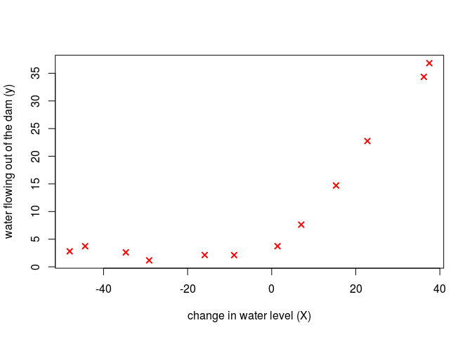
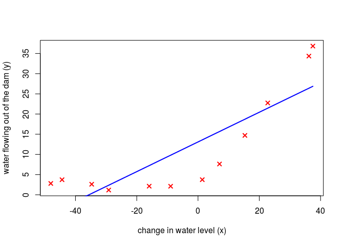
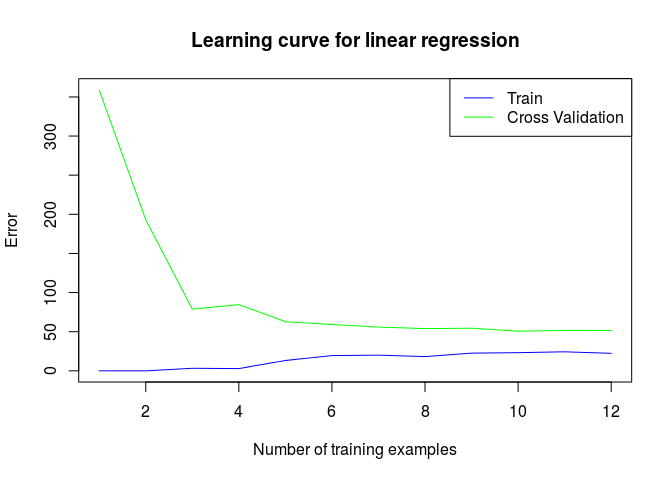
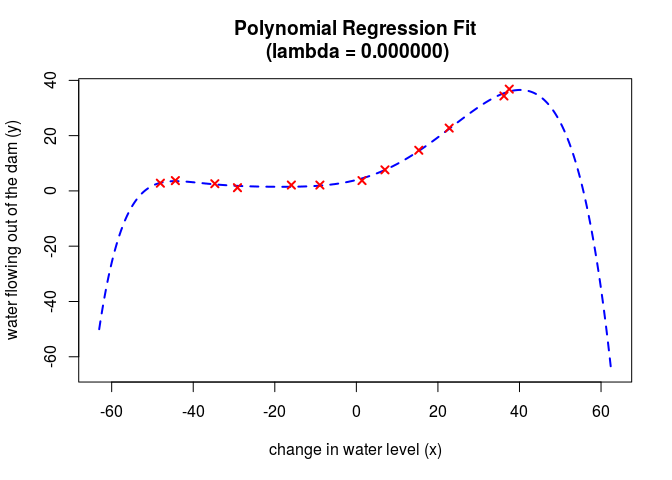
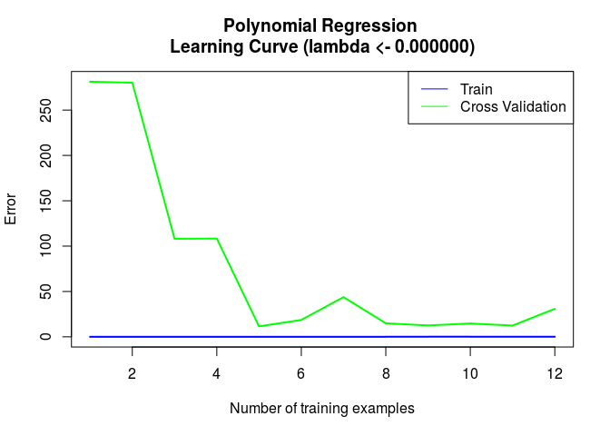
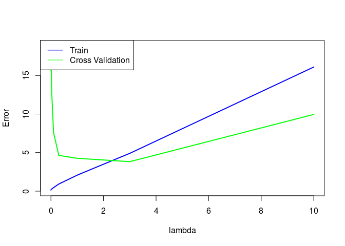

Regularized Linear Regression and Bias-Variance
================

Loading and Visualizing Data
----------------------------

``` r
# Load Training Data
cat(sprintf('Loading and Visualizing Data ...\n'))
```

    ## Loading and Visualizing Data ...

``` r
# Load from ex5data1: 

load(file="ex5data1.Rda") # load data var

list2env(data, env = .GlobalEnv)
```

    ## <environment: R_GlobalEnv>

``` r
rm(data)
# m <- Number of examples
m <- dim(X)[1]

# Plot training data
plot(X, y, pch=4, lwd=2, col=2, xlab="change in water level (X)", 
     ylab= "water flowing out of the dam (y)")
```



Regularized Linear Regression Cost
----------------------------------

``` r
linearRegCostFunction <- function(X, y, lambda) {
  #linearRegCostFunction Compute cost for regularized linear
  #regression with multiple variables
  #   J <- linearRegCostFunction(X, y, lambda)(theta) computes the
  #   cost of using theta as the parameter for linear regression to fit the
  #   data points in X and y. Returns the cost in J
  
  function(theta) {
    # Initialize some useful values
    m <- length(y) # number of training examples
    J <- 0
    h = X %*% theta
    thetas <- theta[-1]
    J <- 1 / (2 * m) * sum((h - y) ^ 2) + (lambda / (2 * m)) * sum(thetas ^ 2)
    J
  }
}

linearRegGradFunction <- function(X, y, lambda) {
  #linearRegGradFunction Compute gradient for regularized linear
  #regression with multiple variables
  #   grad <- linearRegGradFunction(X, y, lambda)(theta) computes the
  #   gradient of using theta as the parameter for linear regression to fit the
  #   data points in X and y. Returns the gradient in grad
  
  function(theta) {
    # Initialize some useful values
    m <- length(y) # number of training examples
    grad <- rep(0,length(theta))
    h = X %*% theta
    # Calculate gradient
    temp <- theta
    temp[1] <- 0
    grad <- (1 / m) * (t(X) %*% (h - y) + lambda * temp)
    grad
  }
}
```

``` r
theta <- c(1,1)
J <- linearRegCostFunction(cbind(1,X), y, 1)(theta)
cat(sprintf('Cost at theta = (1,1): %f \n(this value should be about 303.993192)\n', J))
```

    ## Cost at theta = (1,1): 303.993192 
    ## (this value should be about 303.993192)

Regularized Linear Regression Gradient
--------------------------------------

``` r
theta <- c(1,1)
grad <- linearRegGradFunction(cbind(1,X), y, 1)(theta)

cat(sprintf('Gradient at theta = (1,1):  [%f; %f] \n
(this value should be about [-15.303016; 598.250744])\n',
            grad[1], grad[2]))
```

    ## Gradient at theta = (1,1):  [-15.303016; 598.250744] 
    ## 
    ## (this value should be about [-15.303016; 598.250744])

Train Linear Regression
-----------------------

``` r
trainLinearReg <- function(X, y, lambda) {
  #TRAINLINEARREG Trains linear regression given a dataset (X, y) and a
  #regularization parameter lambda
  #   theta <- TRAINLINEARREG (X, y, lambda) trains linear regression using
  #   the dataset (X, y) and regularization parameter lambda. Returns the
  #   trained parameters theta.
  #
  
  # Initialize Theta
  if (class(X) == "numeric")
    X <- t(X)
  
  initial_theta <- rep(0,dim(X)[2])
  
  # pars <- lbfgsb3_(initial_theta, fn= linearRegCostFunction(X,y,lambda), gr=linearRegGradFunction(X,y,lambda),
  #          control = list(trace=1,maxit=200))$prm
  
  optimRes <- optim(par = initial_theta, 
                    fn = linearRegCostFunction(X,y,lambda), 
                    gr = linearRegGradFunction(X,y,lambda),
                    method = "BFGS")
  optimRes$par
}
```

``` r
#  Train linear regression with lambda <- 0
lambda <- 0
theta <- trainLinearReg(cbind(1,X), y, lambda)

#  Plot fit over the data
plot(X, y, col="red", lwd=2, pch=4, 
     xlab="change in water level (x)",
     ylab="water flowing out of the dam (y)")

lines(X, cbind(1,X) %*% theta, lwd=2, col="blue")
```



Learning Curve for Linear Regression
------------------------------------

``` r
learningCurve  <- function(X, y, Xval, yval, lambda) {
  #LEARNINGCURVE Generates the train and cross validation set errors needed
  #to plot a learning curve
  # Number of training examples
  m <- dim(X)[1]
  error_train <- rep(0,m)
  error_val   <- rep(0,m)
  for (i in 1:m) {
    theta <- trainLinearReg(X[1:i,], y[1:i,], lambda)
    
    #For training set
    h <- X[1:i,] %*% theta
    error_train[i] <- (1 / (2 * i)) * sum((h - y[1:i,]) ^ 2) #cost
    
    #For CV set
    h <- Xval %*% theta
    error_val[i] <- (1 / (2 * m)) * sum((h - yval) ^ 2)
  }
  
  list(error_train = error_train, error_val = error_val)
}
```

``` r
lambda <- 0
lC <- learningCurve(cbind(1,X), y, cbind(1, Xval), yval, lambda)
error_train <- lC$error_train
error_val <- lC$error_val
rm(lC)

#setup plot
plot(c(1:m,1:m),c(error_train,error_val), type="n",
     main='Learning curve for linear regression',
     xlab="Number of training examples", ylab="Error")
lines(1:m, error_train, type="l",col="blue")
lines(1:m, error_val, type="l", col="green")
legend("topright",c("Train","Cross Validation"), 
       col=c("blue","green"), lty=1)
```



``` r
cat(sprintf('# Training Examples\tTrain Error\tCross Validation Error\n'))
```

    ## # Training Examples  Train Error Cross Validation Error

``` r
for (i in 1:m)
    cat(sprintf('  \t%d\t\t%f\t%f\n', i, error_train[i], error_val[i]))
```

    ##      1       0.000000    358.961918
    ##      2       0.000000    193.025640
    ##      3       3.286595    78.767905
    ##      4       2.842678    84.645594
    ##      5       13.154049   62.764039
    ##      6       19.443963   59.202430
    ##      7       20.098522   55.949225
    ##      8       18.172859   54.009281
    ##      9       22.609405   54.487997
    ##      10      23.261462   50.638363
    ##      11      24.317250   51.715004
    ##      12      22.373906   51.509182

Feature Mapping for Polynomial Regression
-----------------------------------------

``` r
polyFeatures  <- function(X, p) {
  #POLYFEATURES Maps X (1D vector) into the p-th power
  X_poly <-  matrix(0,length(X), p)
  for (i in 1:p)
    X_poly[,i] <- X ^ i
  X_poly
}

featureNormalize  <- function(X) {
  mu <- colMeans(X)
  #vectorized multivariate apply
  X_norm <- matrix(mapply(`-`,t(X),mu),dim(X) ,byrow = TRUE)
  sigma <- apply(X,2,sd)
  X_norm <- matrix(mapply(`/`,t(X_norm),sigma),dim(X) ,byrow = TRUE)
  list(X_norm=X_norm, mu=mu, sigma=sigma)
}
```

``` r
p <- 8

# Map X onto Polynomial Features and Normalize
X_poly <- polyFeatures(X, p)
fN <- featureNormalize(X_poly)  # Normalize
X_poly <- fN$X_norm
mu <- fN$mu
sigma <- fN$sigma
rm(fN)

# Add Ones
X_poly <- cbind(rep(1,m), X_poly)

# Map X_poly_test and normalize (using mu and sigma)
X_poly_test <- polyFeatures(Xtest, p)
X_poly_test <- matrix(mapply(`-`,t(X_poly_test),mu),dim(X_poly_test) ,byrow = TRUE)
X_poly_test <- matrix(mapply(`/`,t(X_poly_test),sigma),dim(X_poly_test) ,byrow = TRUE)
X_poly_test <-  cbind(rep(1,dim(X_poly_test)[1]), X_poly_test)

# Map X_poly_val and normalize (using mu and sigma)
X_poly_val <- polyFeatures(Xval, p)
X_poly_val <- matrix(mapply(`-`,t(X_poly_val),mu),dim(X_poly_val) ,byrow = TRUE)
X_poly_val <- matrix(mapply(`/`,t(X_poly_val),sigma),dim(X_poly_val) ,byrow = TRUE)
X_poly_val <-  cbind(rep(1,dim(X_poly_val)[1]), X_poly_val)

cat(sprintf('Normalized Training Example 1:\n'))
```

    ## Normalized Training Example 1:

``` r
cat(sprintf('  %f  \n', X_poly[1,]))
```

    ##   1.000000  
    ##    -0.362141  
    ##    -0.755087  
    ##    0.182226  
    ##    -0.706190  
    ##    0.306618  
    ##    -0.590878  
    ##    0.344516  
    ##    -0.508481

Learning Curve for Polynomial Regression
----------------------------------------

``` r
lambda <- 0
theta <- trainLinearReg(X_poly, y, lambda)

# Plot training data and fit
plotFit <- function (min_x, max_x, mu, sigma, theta, p) {
  #PLOTFIT Plots a learned polynomial regression fit over an existing figure.
  #Also works with linear regression.
  x <- seq(min_x - 15, max_x + 25, 0.05)
  # Map the X values
  X_poly <- polyFeatures(x, p)
  X_poly <- matrix(mapply(`-`,t(X_poly),mu),dim(X_poly) ,byrow = TRUE)
  X_poly <-
    matrix(mapply(`/`,t(X_poly),sigma),dim(X_poly) ,byrow = TRUE)
  # Add ones
  X_poly <-  cbind(rep(1,dim(X_poly)[1]), X_poly)
  # Plot
  plot(
    x, X_poly %*% theta, lwd = 2,type = 'l', lty = 2, col = "blue",
    xlab = "change in water level (x)", ylab = "water flowing out of the dam (y)",
    main = sprintf('Polynomial Regression Fit\n (lambda = %f)', lambda)
  )
}

plotFit(min(X), max(X), mu, sigma, theta, p)
points(X, y, col="red", lwd=2, pch=4)
```



``` r
lC <- learningCurve(X_poly, y, X_poly_val, yval, lambda)
error_train <- lC$error_train
error_val <- lC$error_val
rm(lC)

plot(c(1:m,1:m),c(error_train,error_val), type="n",
     main=sprintf('Polynomial Regression \nLearning Curve (lambda <- %f)', lambda),
     xlab='Number of training examples', ylab="Error")
lines(1:m, error_train, type="l",col="blue",lwd=2)
lines(1:m, error_val, type="l", col="green", lwd=2)
legend("topright",c("Train","Cross Validation"), 
       col=c("blue","green"), lty=1)
```



``` r
cat(sprintf('Polynomial Regression (lambda <- %f)\n\n', lambda))
```

    ## Polynomial Regression (lambda <- 0.000000)

``` r
cat(sprintf('# Training Examples\tTrain Error\tCross Validation Error\n'))
```

    ## # Training Examples  Train Error Cross Validation Error

``` r
for (i in 1:m)
    cat(sprintf('  \t%d\t\t%f\t%f\n', i, error_train[i], error_val[i]))
```

    ##      1       0.000000    281.263324
    ##      2       0.000000    280.212643
    ##      3       0.000000    108.070943
    ##      4       0.000000    108.375567
    ##      5       0.000000    11.546262
    ##      6       0.000000    18.628820
    ##      7       0.000552    43.738211
    ##      8       0.057369    14.932099
    ##      9       0.153188    12.586128
    ##      10      0.129577    14.676782
    ##      11      0.088014    12.414704
    ##      12      0.145370    30.876544

Part 8: Validation for Selecting Lambda
---------------------------------------

``` r
validationCurve <- function(X, y, Xval, yval) {
  #VALIDATIONCURVE Generate the train and validation errors needed to
  #plot a validation curve that we can use to select lambda
  # Selected values of lambda (you should not change this)
  lambda_vec <- c(0, 0.001, 0.003, 0.01, 0.03, 0.1, 0.3, 1, 3, 10)
  error_train <- rep(0, length(lambda_vec))
  error_val <- rep(0,length(lambda_vec))
  for (i in 1:length(lambda_vec)) {
    lambda <- lambda_vec[i]
    theta <- trainLinearReg(X, y, lambda)
    # Set to zero when calculating error since already been trained
    lambda <- 0
    # We are calc J as error not as cost. So, lambda should not be included when
    # calculating error for thetas that have been trained, else it will be biased
    # Refer to 2.1 of Exercise 5, error is computed without lambda
    e_train <- linearRegCostFunction(X, y, lambda)(theta)
    e_val <- linearRegCostFunction(Xval, yval, lambda)(theta)   # J over all CV set for new set of theta
    
    # Accumulating error from i=1:m
    if (i == 1)
    {
      error_train <- e_train
      error_val <- e_val
    }
    else
    {
      error_train <- rbind(error_train, e_train)
      error_val <- rbind(error_val, e_val)
    }
  }
  list(lambda_vec = lambda_vec, error_train = error_train, error_val = error_val)
}
```

``` r
vC <- validationCurve(X_poly, y, X_poly_val, yval)
lambda_vec <- vC$lambda_vec
error_train <- vC$error_train
error_val <- vC$error_val
rm(vC)

plot(c(lambda_vec,lambda_vec),c(error_train,error_val), type="n",
     xlab='lambda', ylab="Error")
lines(lambda_vec, error_train, type="l",col="blue",lwd=2)
lines(lambda_vec, error_val, type="l", col="green", lwd=2)
legend("topleft",c("Train","Cross Validation"), 
       col=c("blue","green"), lty=1)
```



``` r
cat(sprintf('lambda\t\tTrain Error\tValidation Error\n'))
```

    ## lambda       Train Error Validation Error

``` r
for (i in 1:length(lambda_vec))
    cat(sprintf(' %f\t%f\t%f\n',lambda_vec[i], error_train[i], error_val[i]))
```

    ##  0.000000    0.145370    17.643740
    ##  0.001000    0.144891    15.616068
    ##  0.003000    0.183621    18.805870
    ##  0.010000    0.222890    17.072969
    ##  0.030000    0.281966    12.826718
    ##  0.100000    0.459558    7.584437
    ##  0.300000    0.921766    4.636816
    ##  1.000000    2.076187    4.260657
    ##  3.000000    4.901366    3.822920
    ##  10.000000   16.092207   9.945496
