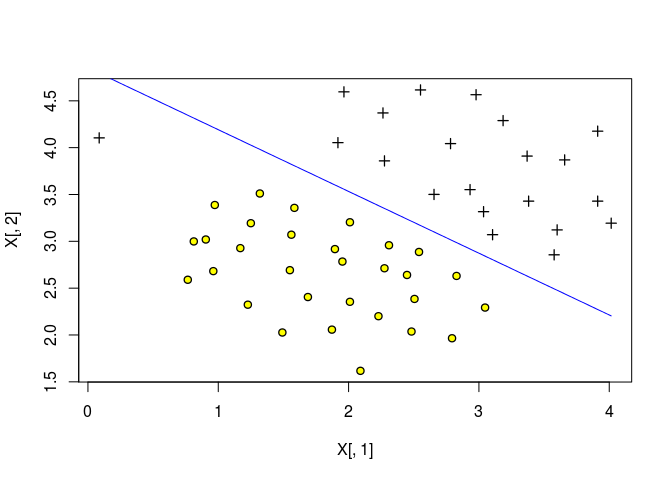
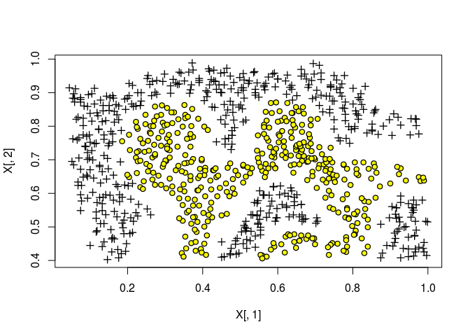
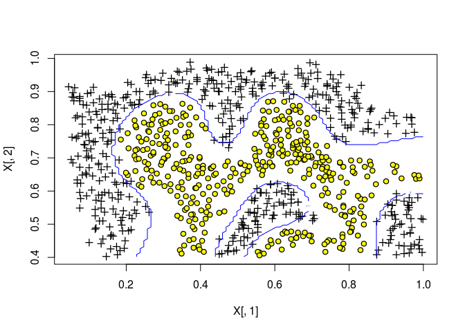

Support Vector Machines with R
================

Initialization
--------------

``` r
rm(list=ls())
sources <- c("gaussianKernel.R","dataset3Params.R", "plotData.R",
             "svmPredict.R","visualizeBoundary.R","bsxfun.R",
             "linearKernel.R","visualizeBoundaryLinear.R","svmTrain.R","meshgrid.R")

for (i in 1:length(sources)) {
  cat(paste("Loading ",sources[i],"\n"))
  source(sources[i])
}
```

    ## Loading  gaussianKernel.R 
    ## Loading  dataset3Params.R 
    ## Loading  plotData.R 
    ## Loading  svmPredict.R 
    ## Loading  visualizeBoundary.R 
    ## Loading  bsxfun.R 
    ## Loading  linearKernel.R 
    ## Loading  visualizeBoundaryLinear.R 
    ## Loading  svmTrain.R 
    ## Loading  meshgrid.R

Part 1: Loading and Visualizing Data
------------------------------------

``` r
cat(sprintf('Loading and Visualizing Data ...\n'))
```

    ## Loading and Visualizing Data ...

``` r
# Load from ex6data1: 
load("ex6data1.Rda")
list2env(data, env = .GlobalEnv)
```

    ## <environment: R_GlobalEnv>

``` r
rm(data)
# Plot training data
plotData(X, y)
```


Part 2: Training Linear SVM
---------------------------

``` r
cat(sprintf('\nTraining Linear SVM ...\n'))
```

    ## 
    ## Training Linear SVM ...

``` r
C <- 1
Rprof()
model <- svmTrain(X, y, C, linearKernel, 1e-3, 20)
```

    ## 
    ## Training ......................................................................
    ## ...............................................................................
    ## ................... Done!

``` r
visualizeBoundaryLinear(X, y, model)
```



Part 3: Implementing Gaussian Kernel
------------------------------------

``` r
cat(sprintf('\nEvaluating the Gaussian Kernel ...\n'))
```

    ## 
    ## Evaluating the Gaussian Kernel ...

``` r
x1 <- c(1, 2, 1)
x2 <- c(0, 4, -1)
sigma <- 2
sim <- gaussianKernel(sigma)(x1, x2)

cat(sprintf('Gaussian Kernel between x1 = [1; 2; 1], x2 = [0; 4; -1], sigma = 0.5 :\n
\t%f\n(this value should be about 0.324652)\n', sim))
```

    ## Gaussian Kernel between x1 = [1; 2; 1], x2 = [0; 4; -1], sigma = 0.5 :
    ## 
    ##  0.324652
    ## (this value should be about 0.324652)

Part 4: Visualizing Dataset 2
-----------------------------

``` r
cat(sprintf('Loading and Visualizing Data ...\n'))
```

    ## Loading and Visualizing Data ...

``` r
load("ex6data2.Rda")
list2env(data,.GlobalEnv)
```

    ## <environment: R_GlobalEnv>

``` r
rm(data)
# Plot training data
plotData(X, y)
```



Part 5: Training SVM with RBF Kernel (Dataset 2)
------------------------------------------------

``` r
cat(sprintf('\nTraining SVM with RBF Kernel (this may take 1 to 2 minutes) ...\n'))
```

    ## 
    ## Training SVM with RBF Kernel (this may take 1 to 2 minutes) ...

``` r
# Load from ex6data2: 
# You will have X, y in your environment
load("ex6data2.Rda")
list2env(data,.GlobalEnv)
```

    ## <environment: R_GlobalEnv>

``` r
rm(data)
# SVM Parameters
C <- 1; sigma <- 0.1

# We set the tolerance and max_passes lower here so that the code will run
# faster. However, in practice, you will want to run the training to
# convergence.
model<- svmTrain(X, y, C, gaussianKernel(sigma))
```

    ## 
    ## Training ......................................................................
    ## ...............................................................................
    ## ...............................................................................
    ## ...............................................................................
    ## ...............................................................................
    ## ...............................................................................
    ## ........................................................ Done!

``` r
q <- visualizeBoundary(X, y, model)
```


