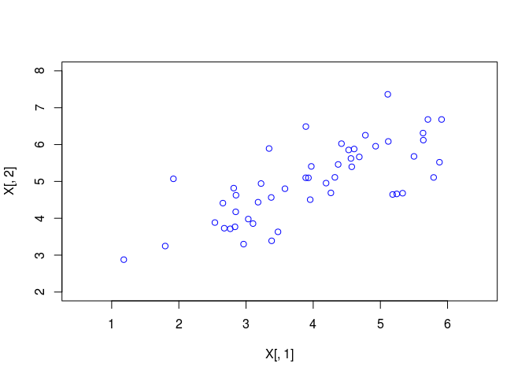
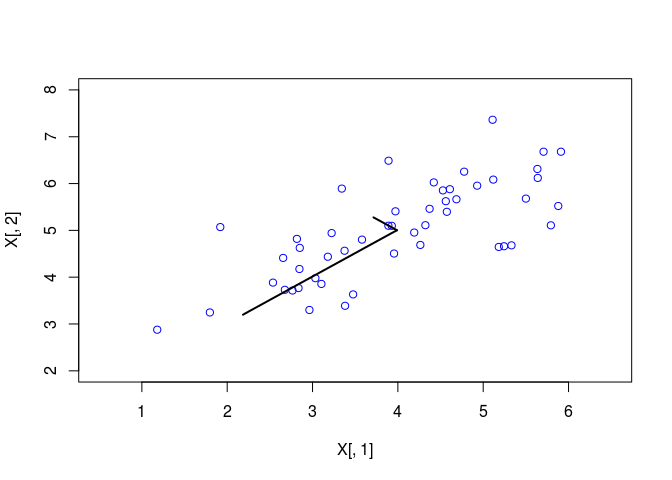
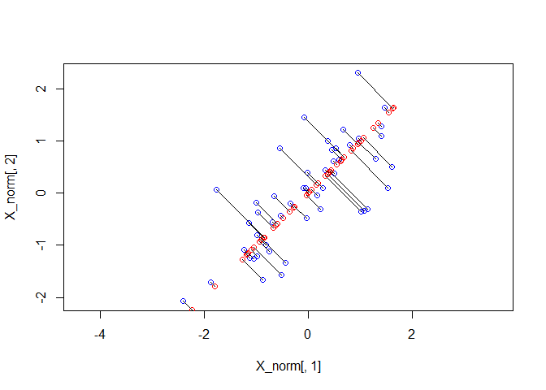
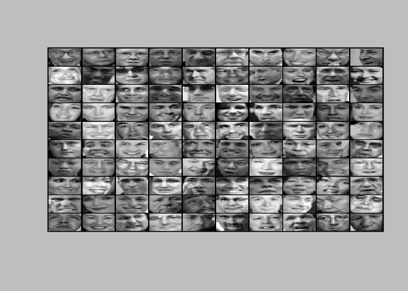
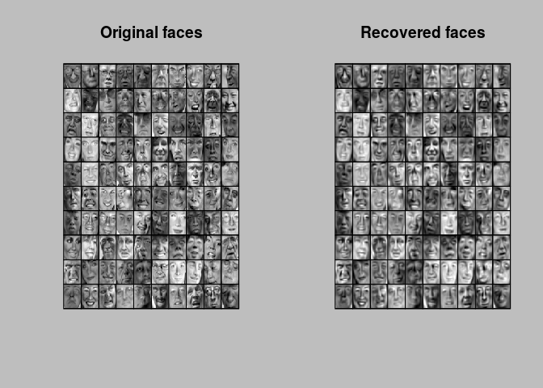
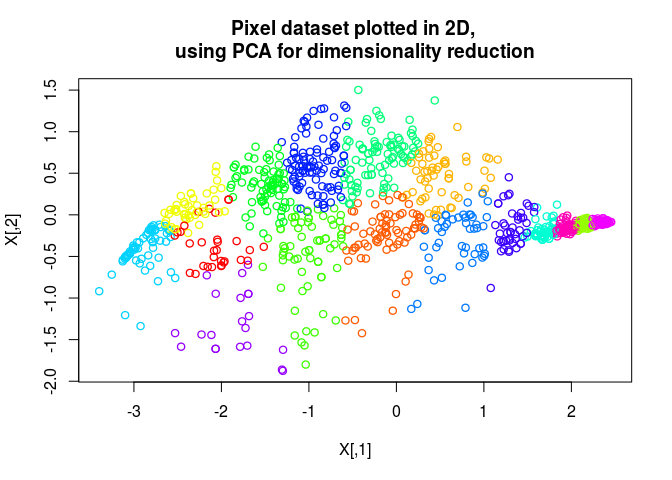

Principle Component Analysis with R
================

Initialization
--------------

``` r
rm(list=ls())
sources <- c("computeCentroids.R","featureNormalize.R","findClosestCentroids.R",
             "kMeansInitCentroids.R","plotDataPoints.R","plotProgresskMeans.R",
             "runkMeans.R","projectData.R","recoverData.R","displayData.R",
             "pca.R","bsxfun.R","computeCentroids.R")

for (i in 1:length(sources)) {
  cat(paste("Loading ",sources[i],"\n"))
  source(sources[i])
}
```

    ## Loading  computeCentroids.R 
    ## Loading  featureNormalize.R 
    ## Loading  findClosestCentroids.R 
    ## Loading  kMeansInitCentroids.R 
    ## Loading  plotDataPoints.R 
    ## Loading  plotProgresskMeans.R 
    ## Loading  runkMeans.R 
    ## Loading  projectData.R 
    ## Loading  recoverData.R 
    ## Loading  displayData.R 
    ## Loading  pca.R 
    ## Loading  bsxfun.R 
    ## Loading  computeCentroids.R

Part 1: Load Example Dataset
----------------------------

``` r
cat(sprintf('Visualizing example dataset for PCA.\n\n'))
```

    ## Visualizing example dataset for PCA.

``` r
#  The following command loads the dataset. You should now have the
#  variable X in your environment
load('ex7data1.Rda')
list2env(data,.GlobalEnv)
```

    ## <environment: R_GlobalEnv>

``` r
rm(data)

#  Visualize the example dataset
plot(X[,1],X[,2],col='blue',
     xlim=c(.5,6.5),ylim=c(2,8))
```



Part 2: Principal Component Analysis
------------------------------------

``` r
cat(sprintf('\nRunning PCA on example dataset.\n\n'))
```

    ## 
    ## Running PCA on example dataset.

``` r
#  Before running PCA, it is important to first normalize X
fN <- featureNormalize(X)
X_norm <- fN$X_norm
mu <- fN$mu
sigma <- fN$sigma

#  Run PCA
USV <- pca(X_norm)
U <- USV$u
S <- diag(USV$d)

#  Compute mu, the mean of the each feature

#  Draw the eigenvectors centered at mean of data. These lines show the
#  directions of maximum variations in the dataset.
plot(X[,1],X[,2],col='blue',
     xlim=c(.5,6.5),ylim=c(2,8))

lines(rbind(t(mu),mu+1.5*S[1,1]*t(U[,1])),lwd=2)

lines(rbind(t(mu),mu+1.5*S[2,2]*t(U[,2])), lwd=2)
```



``` r
cat(sprintf('Top eigenvector: \n'))
```

    ## Top eigenvector:

``` r
cat(sprintf(' U[,1] = %f %f \n', U[1,1],U[2,2]))
```

    ##  U[,1] = -0.707107 0.707107

``` r
cat(sprintf('\n(you should expect to see -0.707107 -0.707107)\n'))
```

    ## 
    ## (you should expect to see -0.707107 -0.707107)

Part 3: Dimension Reduction
---------------------------

``` r
cat(sprintf('\nDimension reduction on example dataset.\n\n'))
```

    ## 
    ## Dimension reduction on example dataset.

``` r
#  Plot the normalized dataset (returned from pca)
plot(X_norm[, 1], X_norm[, 2], col='blue', asp=1)
     #xlim = c(-4,3),ylim=c(-4,3))


#  Project the data onto K = 1 dimension
K <- 1
Z <- projectData(X_norm, U, K)
cat(sprintf('Projection of the first example: %f\n', Z[1]))
```

    ## Projection of the first example: 1.481274

``` r
cat(sprintf('\n(this value should be about 1.481274)\n\n'))
```

    ## 
    ## (this value should be about 1.481274)

``` r
X_rec  <- recoverData(Z, U, K)
cat(sprintf('Approximation of the first example: %f %f\n', X_rec[1,1], X_rec[1,2]))
```

    ## Approximation of the first example: -1.047419 -1.047419

``` r
cat(sprintf('\n(this value should be about  -1.047419 -1.047419)\n\n'))
```

    ## 
    ## (this value should be about  -1.047419 -1.047419)

``` r
#  Draw lines connecting the projected points to the original points
points(X_rec[,1], X_rec[,2],col='red')

for (i in 1:dim(X_norm)[1])
    lines(rbind(X_norm[i,], X_rec[i,]))
```



Part 4: Loading and Visualizing Face Data
-----------------------------------------

``` r
cat(sprintf('\nLoading face dataset.\n\n'))
```

    ## 
    ## Loading face dataset.

``` r
#  Load Face dataset
load('ex7faces.Rda')
list2env(data,.GlobalEnv)
```

    ## <environment: R_GlobalEnv>

``` r
rm(data)

#  Display the first 100 faces in the dataset
displayData(X[1:100,] )
```



Part 5: PCA on Face Data: Eigenfaces
------------------------------------

``` r
cat(sprintf('\nRunning PCA on face dataset.\n (this might take a minute or two ...)\n\n'))
```

    ## 
    ## Running PCA on face dataset.
    ##  (this might take a minute or two ...)

``` r
#  Before running PCA, it is important to first normalize X by subtracting
#  the mean value from each feature
fN <- featureNormalize(X)
X_norm <- fN$X_norm
mu <- fN$mu
sigma <- fN$sigma

#  Run PCA
USV <- pca(X_norm)
U <- USV$u
S <- diag(USV$d)

#  Visualize the top 36 eigenvectors found
displayData(t(U[, 1:36]))
```


Part 6: Dimension Reduction for Faces
-------------------------------------

``` r
cat(sprintf('\nDimension reduction for face dataset.\n\n'))
```

    ## 
    ## Dimension reduction for face dataset.

``` r
K <- 100
Z <- projectData(X_norm, U, K)

cat(sprintf('The projected data Z has a size of: '))
```

    ## The projected data Z has a size of:

``` r
cat(sprintf('%d ', dim(Z)))
```

    ## 5000  100

Part 7: Visualization of Faces after PCA Dimension Reduction
------------------------------------------------------------

``` r
cat(sprintf('\nVisualizing the projected (reduced dimension) faces.\n\n'))
```

    ## 
    ## Visualizing the projected (reduced dimension) faces.

``` r
K <- 100
X_rec  <- recoverData(Z, U, K)

op <- par(mfrow=c(1,2))
# Display normalized data
displayData(X_norm[1:100,])
title('Original faces')


# Display reconstructed data from only k eigenfaces
displayData(X_rec[1:100,])
title(main='Recovered faces')
```



``` r
par(op)
```

Part 8: Optional (ungraded) Exercise: PCA for Visualization
-----------------------------------------------------------

``` r
load('bird_small.Rda')
list2env(data, .GlobalEnv)
```

    ## <environment: R_GlobalEnv>

``` r
rm(data)

A <- A / 255
img_size <- dim(A)
X <- matrix(A, img_size[1] * img_size[2], 3)
K <- 16
max_iters <- 10
initial_centroids <- kMeansInitCentroids(X, K)
kMean <- runkMeans(X, initial_centroids, max_iters)
```

    ## K-Means iteration 1/10...
    ## K-Means iteration 2/10...
    ## K-Means iteration 3/10...
    ## K-Means iteration 4/10...
    ## K-Means iteration 5/10...
    ## K-Means iteration 6/10...
    ## K-Means iteration 7/10...
    ## K-Means iteration 8/10...
    ## K-Means iteration 9/10...
    ## K-Means iteration 10/10...

``` r
centroids <- kMean$centroids
idx <- kMean$idx
#  Sample 1000 random indexes (since working with all the data is
#  too expensive. If you have a fast computer, you may increase this.
sel <- floor(runif(1000) * dim(X)[1]) + 1

#  Setup Color Palette
colors <- rainbow(K)[idx[sel]]

# Use PCA to project this cloud to 2D for visualization

# Subtract the mean to use PCA
fN <- featureNormalize(X)
X_norm <-fN$X_norm
mu <- fN$mu
sigma <- fN$sigma

# PCA and project the data to 2D
USV <- pca(X_norm)
U <- USV$u
S <- diag(USV$d)

Z <- projectData(X_norm, U, 2)

# Plot in 2D
plotDataPoints(Z[sel, ], idx[sel], K, FALSE)
title(main='Pixel dataset plotted in 2D, \nusing PCA for dimensionality reduction')
```


