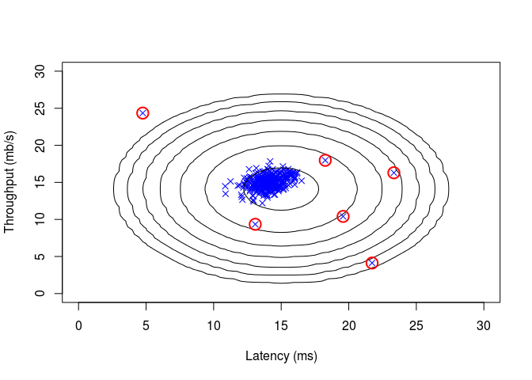

Anomaly Detection with R
================

Initialization
--------------

``` r
rm(list=ls())
sources <- c("bsxfun.R","estimateGaussian.R","meshgrid.R",
             "multivariateGaussian.R","pinv.R","selectThreshold.R",
             "visualizeFit.R")
             
for (i in 1:length(sources)) {
  cat(paste("Loading ",sources[i],"\n"))
  source(sources[i])
}
```

    ## Loading  bsxfun.R 
    ## Loading  estimateGaussian.R 
    ## Loading  meshgrid.R 
    ## Loading  multivariateGaussian.R 
    ## Loading  pinv.R 
    ## Loading  selectThreshold.R 
    ## Loading  visualizeFit.R

Part 1: Load Example Dataset
----------------------------

``` r
cat(sprintf('Visualizing example dataset for outlier detection.\n\n'))
```

    ## Visualizing example dataset for outlier detection.

``` r
#  The following command loads the dataset. You should now have the
#  variables X, Xval, yval in your environment
load("ex8data1.Rda")
list2env(data,.GlobalEnv)
```

    ## <environment: R_GlobalEnv>

``` r
rm(data)

#  Visualize the example dataset
plot(X[,1], X[,2], xlim=c(0,30),ylim=c(0,30), pch=4, col="blue",
     xlab='Latency (ms)', ylab='Throughput (mb/s)')
```


Part 2: Estimate the dataset statistics
---------------------------------------

``` r
cat(sprintf('Visualizing Gaussian fit.\n\n'))
```

    ## Visualizing Gaussian fit.

``` r
#  Estimate mu and sigma2
eG <- estimateGaussian(X)
mu <- eG$mu
sigma2 <- eG$sigma2

#  Returns the density of the multivariate normal at each data point (row) 
#  of X
p <- multivariateGaussian(X, mu, sigma2)

#  Visualize the fit
visualizeFit(X,  mu, sigma2)
```


Part 3: Find Outliers
---------------------

``` r
pval <- multivariateGaussian(Xval, mu, sigma2)

sT <- selectThreshold(yval, pval)
epsilon <- sT$bestEpsilon
F1 <- sT$bestF1

cat(sprintf('Best epsilon found using cross-validation: %e\n', epsilon))
```

    ## Best epsilon found using cross-validation: 8.990853e-05

``` r
cat(sprintf('Best F1 on Cross Validation Set:  %f\n', F1))
```

    ## Best F1 on Cross Validation Set:  0.875000

``` r
cat(sprintf('(you should see a value epsilon of about 8.99e-05)\n\n'))
```

    ## (you should see a value epsilon of about 8.99e-05)

``` r
#  Find the outliers in the training set and plot the
outliers <- which(p < epsilon)

#  Draw a red circle around those outliers
visualizeFit(X,  mu, sigma2)
points(X[outliers, 1], X[outliers, 2], col="red", lwd=2, cex=2 )
```



Part 4: Multidimensional Outliers
---------------------------------

``` r
#  Loads the second dataset. You should now have the
#  variables X, Xval, yval in your environment
load("ex8data2.Rda")
list2env(data,.GlobalEnv)
```

    ## <environment: R_GlobalEnv>

``` r
rm(data)

#  Apply the same steps to the larger dataset
eG <- estimateGaussian(X)
mu <- eG$mu
sigma2 <- eG$sigma2
rm(eG)

#  Training set 
p <- multivariateGaussian(X, mu, sigma2)

#  Cross-validation set
pval <- multivariateGaussian(Xval, mu, sigma2)

#  Find the best threshold
sT <- selectThreshold(yval, pval)
epsilon <- sT$bestEpsilon
F1 <- sT$bestF1

cat(sprintf('Best epsilon found using cross-validation: %e\n', epsilon))
```

    ## Best epsilon found using cross-validation: 1.377229e-18

``` r
cat(sprintf('Best F1 on Cross Validation Set:  %f\n', F1))
```

    ## Best F1 on Cross Validation Set:  0.615385

``` r
cat(sprintf('# Outliers found: %d\n', sum(p < epsilon)))
```

    ## # Outliers found: 117

``` r
cat(sprintf('   (you should see a value epsilon of about 1.38e-18)\n\n'))
```

    ##    (you should see a value epsilon of about 1.38e-18)
