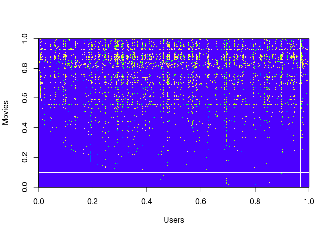

Collaborative Filtering with R
================

Initialization
--------------

``` r
rm(list=ls())
sources <- c("loadMovieList.R","checkCostFunction.R","cofiCostFunc.R","lbfgsb3_.R",
             "computeNumericalGradient.R","normalizeRatings.R","lbfgsb3_.R")

for (i in 1:length(sources)) {
  cat(paste("Loading ",sources[i],"\n"))
  source(sources[i])
}
```

    ## Loading  loadMovieList.R 
    ## Loading  checkCostFunction.R 
    ## Loading  cofiCostFunc.R 
    ## Loading  lbfgsb3_.R 
    ## Loading  computeNumericalGradient.R 
    ## Loading  normalizeRatings.R 
    ## Loading  lbfgsb3_.R

Part 1: Loading movie ratings dataset
-------------------------------------

``` r
cat(sprintf('Loading movie ratings dataset.\n\n'))
```

    ## Loading movie ratings dataset.

``` r
#  Load data
load("ex8_movies.Rda")
list2env(data,.GlobalEnv)
```

    ## <environment: R_GlobalEnv>

``` r
rm(data)

#  Y is a 1682x943 matrix, containing ratings (1-5) of 1682 movies on 
#  943 users
#
#  R is a 1682x943 matrix, where R[i,j] <- 1 if and only if user j gave a
#  rating to movie i

#  From the matrix, we can compute statistics like average rating.
cat(sprintf('Average rating for movie 1 (Toy Story): %f / 5\n\n', 
        mean(Y[1, R[1, ]==1] ) ) )
```

    ## Average rating for movie 1 (Toy Story): 3.878319 / 5

``` r
#  We can "visualize" the ratings matrix by plotting it with image
revY <- apply(Y,2,rev)
image(t(revY) ,ylab="Movies",xlab="Users",
      col=topo.colors(50))
```



Part 2: Collaborative Filtering Cost Function
---------------------------------------------

``` r
#  Load pre-trained weights (X, Theta, num_users, num_movies, num_features)
load("ex8_movieParams.Rda")
list2env(data,.GlobalEnv)
```

    ## <environment: R_GlobalEnv>

``` r
rm(data)

#  Reduce the data set size so that this runs faster
num_users <- 4; num_movies <- 5; num_features <- 3
X <- X[1:num_movies, 1:num_features]
Theta <- Theta[1:num_users, 1:num_features]
Y <- Y[1:num_movies, 1:num_users]
R <- R[1:num_movies, 1:num_users]

#  Evaluate cost function
J <- cofiCostFunc( Y, R, num_users, num_movies,
               num_features, 0)(c(c(X),c(Theta)))
           
cat(sprintf('Cost at loaded parameters: %f 
(this value should be about 22.22)\n', J))
```

    ## Cost at loaded parameters: 22.224604 
    ## (this value should be about 22.22)

Part 3: Collaborative Filtering Gradient
----------------------------------------

``` r
cat(sprintf('\nChecking Gradients (without regularization) ... \n'))
```

    ## 
    ## Checking Gradients (without regularization) ...

``` r
#  Check gradients by running checkNNGradients
checkCostFunction()
```

    ##           numgrad        grad
    ##  [1,] -2.44631063 -2.44631063
    ##  [2,]  1.00340989  1.00340989
    ##  [3,] -0.28570956 -0.28570956
    ##  [4,]  0.00000000  0.00000000
    ##  [5,] -1.22830457 -1.22830457
    ##  [6,]  2.35833907  2.35833907
    ##  [7,] -1.78654227 -1.78654227
    ##  [8,]  0.00000000  0.00000000
    ##  [9,]  6.58763528  6.58763528
    ## [10,] -0.08554255 -0.08554255
    ## [11,]  1.25280767  1.25280767
    ## [12,]  0.00000000  0.00000000
    ## [13,]  1.83827167  1.83827167
    ## [14,] -0.10513122 -0.10513122
    ## [15,] -0.25494904 -0.25494904
    ## [16,] -0.21125515 -0.21125515
    ## [17,]  0.25733000  0.25733000
    ## [18,] -1.91666697 -1.91666697
    ## [19,] -1.76155054 -1.76155054
    ## [20,] -1.17360264 -1.17360264
    ## [21,] -3.53973459 -3.53973459
    ## [22,]  1.18456286  1.18456286
    ## [23,]  0.87525471  0.87525471
    ## [24,]  0.02381256  0.02381256
    ## [25,]  1.28782176  1.28782176
    ## [26,]  0.04784996  0.04784996
    ## [27,] -1.29984867 -1.29984867
    ## The above two columns you get should be very similar.
    ##     (Left-Your Numerical Gradient, Right-Analytical Gradient)
    ## 
    ## If your backpropagation implementation is correct, then
    ##       the relative difference will be small (less than 1e-9). 
    ## 
    ##       Relative Difference: 6.97514e-13

Part 4: Collaborative Filtering Cost Regularization
---------------------------------------------------

``` r
#  Evaluate cost function
J <- cofiCostFunc(Y, R, num_users, num_movies, 
               num_features, 1.5)(c(c(X),c(Theta)))
           
cat(sprintf('Cost at loaded parameters (lambda = 1.5): %f
(this value should be about 31.34)\n', J))
```

    ## Cost at loaded parameters (lambda = 1.5): 31.344056
    ## (this value should be about 31.34)

Part 5: Collaborative Filtering Gradient Regularization
-------------------------------------------------------

``` r
cat(sprintf('\nChecking Gradients (with regularization) ... \n'))
```

    ## 
    ## Checking Gradients (with regularization) ...

``` r
#  Check gradients by running checkNNGradients
checkCostFunction(1.5)
```

    ##           numgrad        grad
    ##  [1,]  4.36361157  4.36361157
    ##  [2,]  3.86477879  3.86477879
    ##  [3,] -2.68695135 -2.68695135
    ##  [4,]  5.00904006  5.00904006
    ##  [5,]  9.83713399  9.83713399
    ##  [6,] -0.03290325 -0.03290325
    ##  [7,] -3.88772505 -3.88772505
    ##  [8,]  4.21874103  4.21874103
    ##  [9,] -4.27772304 -4.27772304
    ## [10,] -2.68312729 -2.68312729
    ## [11,] -1.23781171 -1.23781171
    ## [12,] -2.84483549 -2.84483549
    ## [13,] -2.42641103 -2.42641103
    ## [14,]  1.33540095  1.33540095
    ## [15,]  5.61273456  5.61273456
    ## [16,]  0.37819187  0.37819187
    ## [17,]  2.20992202  2.20992202
    ## [18,] -3.40296122 -3.40296122
    ## [19,]  4.81846302  4.81846302
    ## [20,]  3.41263863  3.41263863
    ## [21,]  1.65387807  1.65387807
    ## [22,]  6.22723380  6.22723380
    ## [23,]  2.39477441  2.39477441
    ## [24,] -0.28025932 -0.28025932
    ## [25,] -3.09871518 -3.09871518
    ## [26,]  0.54597233  0.54597233
    ## [27,]  0.38384269  0.38384269
    ## The above two columns you get should be very similar.
    ##     (Left-Your Numerical Gradient, Right-Analytical Gradient)
    ## 
    ## If your backpropagation implementation is correct, then
    ##       the relative difference will be small (less than 1e-9). 
    ## 
    ##       Relative Difference: 1.68179e-12

Part 6: Entering ratings for a new user
---------------------------------------

``` r
movieList <- loadMovieList()

#  Initialize my ratings
my_ratings <- rep(0,1682)

# Check the file movie_idx.txt for id of each movie in our dataset
# For example, Toy Story (1995) has ID 1, so to rate it "4", you can set
my_ratings[1] <- 4

# Or suppose did not enjoy Silence of the Lambs (1991), you can set
my_ratings[98] <- 2

# We have selected a few movies we liked / did not like and the ratings we
# gave are as follows:
my_ratings[7] <- 3
my_ratings[12]<- 5
my_ratings[54] <- 4
my_ratings[64]<- 5
my_ratings[66]<- 3
my_ratings[69] <- 5
my_ratings[183] <- 4
my_ratings[226] <- 5
my_ratings[355]<- 5

cat(sprintf('\n\nNew user ratings:\n'))
```

    ## 
    ## 
    ## New user ratings:

``` r
for (i in 1:length(my_ratings))
    if (my_ratings[i] > 0 )
        cat(sprintf('Rated %d for %s\n', my_ratings[i], movieList[i]))
```

    ## Rated 4 for Toy Story (1995)
    ## Rated 3 for Twelve Monkeys (1995)
    ## Rated 5 for Usual Suspects, The (1995)
    ## Rated 4 for Outbreak (1995)
    ## Rated 5 for Shawshank Redemption, The (1994)
    ## Rated 3 for While You Were Sleeping (1995)
    ## Rated 5 for Forrest Gump (1994)
    ## Rated 2 for Silence of the Lambs, The (1991)
    ## Rated 4 for Alien (1979)
    ## Rated 5 for Die Hard 2 (1990)
    ## Rated 5 for Sphere (1998)

Part 7: Learning Movie Ratings
------------------------------

``` r
cat(sprintf('\nTraining collaborative filtering...\n'))
```

    ## 
    ## Training collaborative filtering...

``` r
#  Load data
load("ex8_movies.Rda")
list2env(data,.GlobalEnv)
```

    ## <environment: R_GlobalEnv>

``` r
rm(data)

#  Y is a 1682x943 matrix, containing ratings (1-5) of 1682 movies by 
#  943 users
#
#  R is a 1682x943 matrix, where R[i,j] <- 1 if and only if user j gave a
#  rating to movie i

#  Add our own ratings to the data matrix
Y <- cbind(my_ratings, Y)
R <- cbind((my_ratings != 0), R)

#  Normalize Ratings
NR  <- normalizeRatings(Y, R)
Ynorm <- NR$Ynorm
Ymean <- NR$Ymean
#  Useful Values
num_users <- dim(Y)[2]
num_movies <- dim(Y)[1]
num_features <- 10

# Set Initial Parameters (Theta, X)
n <- num_movies * num_features
X <- matrix(rnorm(n), num_movies, num_features)

n <- num_users * num_features
Theta <-  matrix(rnorm(n), num_users, num_features)

initial_parameters <- c(c(X), c(Theta))

# Set Regularization
lambda <- 10

cF <- cofiCostFunc(Y, R, num_users, num_movies,num_features, lambda)
gF <- cofiGradFunc(Y, R, num_users, num_movies,num_features, lambda)

#lbfgsb3 works like fmincg
library(lbfgsb3)
```

    ## Loading required package: numDeriv

``` r
theta <- lbfgsb3_(initial_parameters, fn= cF, gr=gF,
        control = list(trace=1,maxit=100))$prm
```

    ## This problem is unconstrained.
    ## At iteration  0  f = 1337391
    ## At iteration  2  f = 1315705
    ## At iteration  3  f = 1235334
    ## At iteration  4  f = 840635.4
    ## At iteration  5  f = 647411.8
    ## At iteration  6  f = 1447492
    ## At iteration  7  f = 423868.7
    ## At iteration  8  f = 10105793
    ## At iteration  9  f = 366472.7
    ## At iteration  10  f = 258706.1
    ## At iteration  11  f = 183873.2
    ## At iteration  12  f = 153067.4
    ## At iteration  13  f = 133686.3
    ## At iteration  14  f = 121500
    ## At iteration  15  f = 115256.7
    ## At iteration  16  f = 108593
    ## At iteration  17  f = 104075.1
    ## At iteration  18  f = 99518.58
    ## At iteration  19  f = 95744.09
    ## At iteration  20  f = 92072.39
    ## At iteration  21  f = 89350.51
    ## At iteration  22  f = 85688.9
    ## At iteration  23  f = 84107.11
    ## At iteration  24  f = 82196.55
    ## At iteration  25  f = 81636.77
    ## At iteration  26  f = 79512.35
    ## At iteration  27  f = 78840.09
    ## At iteration  28  f = 78022.43
    ## At iteration  29  f = 76962.16
    ## At iteration  30  f = 77416.08
    ## At iteration  31  f = 76494.46
    ## At iteration  32  f = 75940.11
    ## At iteration  33  f = 75628.58
    ## At iteration  34  f = 75281.1
    ## At iteration  35  f = 75020.9
    ## At iteration  36  f = 74750.8
    ## At iteration  37  f = 74535.49
    ## At iteration  38  f = 74354.07
    ## At iteration  39  f = 74287.28
    ## At iteration  40  f = 73966.64
    ## At iteration  41  f = 73892.83
    ## At iteration  42  f = 73770.51
    ## At iteration  43  f = 73634.49
    ## At iteration  44  f = 73512.27
    ## At iteration  45  f = 73426.04
    ## At iteration  46  f = 73311.02
    ## At iteration  47  f = 73235.76
    ## At iteration  48  f = 73144.27
    ## At iteration  49  f = 73047.45
    ## At iteration  50  f = 72979.92
    ## At iteration  51  f = 72904.91
    ## At iteration  52  f = 72838.12
    ## At iteration  53  f = 72792.18
    ## At iteration  54  f = 72753.15
    ## At iteration  55  f = 72683.07
    ## At iteration  56  f = 72646.34
    ## At iteration  57  f = 72612.87
    ## At iteration  58  f = 72580.05
    ## At iteration  59  f = 72550.02
    ## At iteration  60  f = 72522.95
    ## At iteration  61  f = 72481.72
    ## At iteration  62  f = 72456.49
    ## At iteration  63  f = 72428.04
    ## At iteration  64  f = 72393.82
    ## At iteration  65  f = 72357.49
    ## At iteration  66  f = 72335.47
    ## At iteration  67  f = 72306.81
    ## At iteration  68  f = 72298.39
    ## At iteration  69  f = 72272.83
    ## At iteration  70  f = 72258.78
    ## At iteration  71  f = 72243.19
    ## At iteration  72  f = 72218.56
    ## At iteration  73  f = 72199.89
    ## At iteration  74  f = 72183.5
    ## At iteration  75  f = 72171.67
    ## At iteration  76  f = 72160.16
    ## At iteration  77  f = 72152.23
    ## At iteration  78  f = 72131.47
    ## At iteration  79  f = 72122.8
    ## At iteration  80  f = 72114.01
    ## At iteration  81  f = 72099.42
    ## At iteration  82  f = 72095.85
    ## At iteration  83  f = 72082.67
    ## At iteration  84  f = 72077.82
    ## At iteration  85  f = 72068.27
    ## At iteration  86  f = 72058.52
    ## At iteration  87  f = 72048.03
    ## At iteration  88  f = 72041.52
    ## At iteration  89  f = 72034.74
    ## At iteration  90  f = 72029.71
    ## At iteration  91  f = 72023.54
    ## At iteration  92  f = 72017.94
    ## At iteration  93  f = 72010.73
    ## At iteration  94  f = 72007.91
    ## At iteration  95  f = 71996.98
    ## At iteration  96  f = 71993.6
    ## At iteration  97  f = 71990.88
    ## At iteration  98  f = 71986.53
    ## At iteration  99  f = 71985.22
    ## At iteration  100  f = 71978.83
    ## At iteration  101  f = 71976.92

``` r
#The following code works but optim is slow on this problem
#theta <- optim(initial_parameters, fn = cF, gr = gF,
       #method = "BFGS", control = list(maxit=10, trace=1, REPORT=1) )$par

# Unfold the returned theta back into U and W
X <- matrix(theta[1:(num_movies*num_features)], num_movies, num_features)
Theta <- matrix(theta[(num_movies*num_features+1):length(theta)], 
                num_users, num_features)

cat(sprintf('Recommender system learning completed.\n'))
```

    ## Recommender system learning completed.

Part 8: recommendation for you
------------------------------

``` r
p <- X %*% t(Theta)
my_predictions <- p[,1] + Ymean

movieList <- loadMovieList()

ix <- sort(my_predictions, decreasing = TRUE,index.return=TRUE)$ix

cat(sprintf('\nTop recommendations for you:\n'))
```

    ## 
    ## Top recommendations for you:

``` r
for (i in 1:10){
    j <- ix[i]
    cat(sprintf('Predicting rating %.1f for movie %s\n', my_predictions[j],movieList[j]))
}
```

    ## Predicting rating 8.5 for movie Star Wars (1977)
    ## Predicting rating 8.5 for movie Titanic (1997)
    ## Predicting rating 8.3 for movie Shawshank Redemption, The (1994)
    ## Predicting rating 8.3 for movie Raiders of the Lost Ark (1981)
    ## Predicting rating 8.2 for movie Schindler's List (1993)
    ## Predicting rating 8.1 for movie Good Will Hunting (1997)
    ## Predicting rating 8.1 for movie Empire Strikes Back, The (1980)
    ## Predicting rating 8.0 for movie Usual Suspects, The (1995)
    ## Predicting rating 8.0 for movie Godfather, The (1972)
    ## Predicting rating 8.0 for movie Braveheart (1995)

``` r
cat(sprintf('\n\nOriginal ratings provided:\n'))
```

    ## 
    ## 
    ## Original ratings provided:

``` r
for (i in 1:length(my_ratings))
    if (my_ratings[i] > 0 )
        cat(sprintf('Rated %d for %s\n', my_ratings[i],movieList[i]))
```

    ## Rated 4 for Toy Story (1995)
    ## Rated 3 for Twelve Monkeys (1995)
    ## Rated 5 for Usual Suspects, The (1995)
    ## Rated 4 for Outbreak (1995)
    ## Rated 5 for Shawshank Redemption, The (1994)
    ## Rated 3 for While You Were Sleeping (1995)
    ## Rated 5 for Forrest Gump (1994)
    ## Rated 2 for Silence of the Lambs, The (1991)
    ## Rated 4 for Alien (1979)
    ## Rated 5 for Die Hard 2 (1990)
    ## Rated 5 for Sphere (1998)
